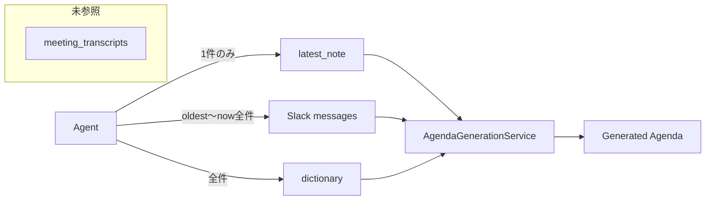
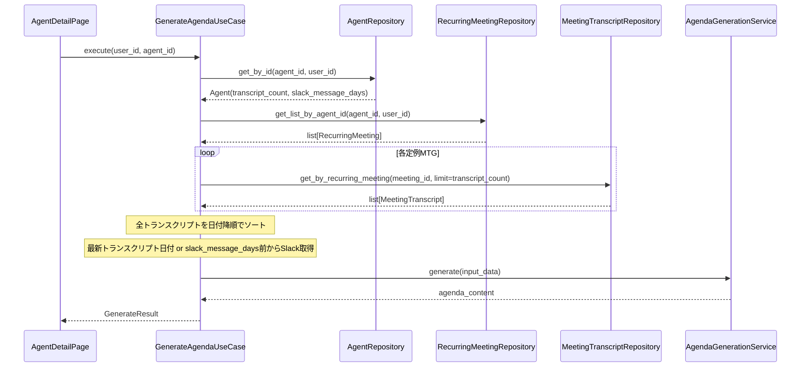

# アジェンダ生成参照情報設定 設計書

## 概要

エージェントにアジェンダ生成時の参照情報設定（トランスクリプト参照件数、Slackメッセージ取得日数）を追加し、複数定例会議からのトランスクリプト収集とSlackメッセージの取得範囲制御を実現する。

## 設計サマリー（メタ）

```yaml
design_type: "拡張"
risk_level: "中"
main_constraints:
  - "既存のagentsテーブルRLSポリシーを維持"
  - "GenerateAgendaUseCaseの後方互換性を確保"
  - "ADR-0005で決定された1対多定例対応との整合性"
biggest_risks:
  - "複数定例からのトランスクリプト収集時のパフォーマンス劣化"
  - "プロンプトの文脈超過（トークン数制限）"
unknowns:
  - "最適なトランスクリプト参照件数のデフォルト値（3件で十分か）"
  - "Slackメッセージ量が多い場合のフィルタリング戦略"
```

## 背景と経緯

### 前提となるADR

- [ADR-0005: 1エージェント複数定例会議の紐付け対応](../adr/ADR-0005-agent-multiple-recurring-meetings.md): 複数定例からのデータ収集基盤
- [ADR-0006: アジェンダ生成の参照情報設定](../adr/ADR-0006-agent-reference-settings.md): Agentテーブルへの直接カラム追加を決定
- [ADR-0001: クリーンアーキテクチャ採用](../adr/ADR-0001-clean-architecture-adoption.md): レイヤー責務の分離
- [ADR-0004: RLSベースの認可アーキテクチャ](../adr/ADR-0004-rls-based-authorization.md): データアクセス制御

### 合意事項チェックリスト

#### スコープ
- [x] Agentエンティティに`transcript_count`、`slack_message_days`フィールドを追加
- [x] DBマイグレーション（agentsテーブルへのカラム追加）
- [x] GenerateAgendaUseCaseの変更（トランスクリプト収集・Slack取得範囲制御）
- [x] AgendaGenerationServiceのプロンプト変更（トランスクリプト情報の組み込み）
- [x] フロントエンドの設定UI追加

#### スコープ外（明示的に変更しないもの）
- [x] 既存のagentsテーブルのRLSポリシー（追加不要）
- [x] meeting_transcriptsテーブルの構造
- [x] Slackメッセージ取得のページネーション（現状維持）

#### 制約
- [x] 並行運用: しない（デフォルト値適用で既存データ互換）
- [x] 後方互換性: 必要（既存エージェントはデフォルト設定で動作）
- [x] パフォーマンス計測: 必要（複数定例トランスクリプト収集時）

### 解決すべき課題

1. **トランスクリプト未参照**: 現在のアジェンダ生成は`meeting_transcripts`テーブルのデータを参照せず、`latest_note`（手動アップロード議事録）のみを使用
2. **Slackメッセージ取得範囲固定**: `oldest`から現在までの全メッセージを取得し、ユーザーが範囲を制御できない
3. **複数定例の横断収集未対応**: ADR-0005で1対多対応が決定されたが、アジェンダ生成時に全定例のトランスクリプトを収集する仕組みがない

### 現状の課題



### 要件

#### 機能要件

- エージェントごとに参照するトランスクリプト件数を設定可能（デフォルト: 3件）
- エージェントごとにSlackメッセージ取得日数を設定可能（デフォルト: 7日）
- 複数の定例MTGに紐付けられている場合、全ての定例からトランスクリプトを収集
- 設定はフロントエンドのエージェント詳細画面から変更可能

#### 非機能要件

- **パフォーマンス**: トランスクリプト収集は5秒以内に完了
- **スケーラビリティ**: 10定例 x 3件 = 30件のトランスクリプトを処理可能
- **信頼性**: トランスクリプト取得失敗時もアジェンダ生成を継続
- **保守性**: 既存コードへの影響を最小限に抑制

## 受入条件（AC）- EARS形式

### 参照設定の保存

- [ ] **When** エージェント作成時、システムはデフォルト値（transcript_count: 3, slack_message_days: 7）を適用する
  - **Property**: `agent.transcript_count === 3 && agent.slack_message_days === 7`
- [ ] **When** ユーザーがトランスクリプト参照件数を変更すると、システムは0-10の範囲で値を保存する
  - **Property**: `0 <= transcript_count <= 10`
- [ ] **When** ユーザーがSlackメッセージ取得日数を変更すると、システムは1-30の範囲で値を保存する
  - **Property**: `1 <= slack_message_days <= 30`
- [ ] **If** 範囲外の値が入力された場合、**then** システムはバリデーションエラーを返す

### トランスクリプト収集

- [ ] **When** アジェンダ生成がリクエストされると、システムは全ての紐付け定例MTGからトランスクリプトを収集する
- [ ] **When** 複数定例が紐付けられている場合、システムは各定例から設定された件数のトランスクリプトを取得し、日付降順でソートする
- [ ] **If** 紐付け定例がない場合、**then** トランスクリプトなしでアジェンダ生成を継続する
- [ ] **If** トランスクリプト取得でエラーが発生した場合、**then** 取得できた分のみでアジェンダ生成を継続する
  - **Property**: `result.has_transcripts === (transcripts.length > 0)`

### Slackメッセージ取得範囲

- [ ] **When** アジェンダ生成時、システムは`slack_message_days`で指定された日数分のメッセージを取得する
- [ ] **If** 最新トランスクリプトの日付が存在する場合、**then** その日付から現在までのメッセージを取得する
- [ ] **If** 最新トランスクリプトの日付がない場合、**then** `slack_message_days`前から現在までのメッセージを取得する

### プロンプト生成

- [ ] システムは収集したトランスクリプトをプロンプトに含め、「複数の定例MTGからのトランスクリプト」であることを明示する
- [ ] **If** トランスクリプトが0件の場合、**then** トランスクリプトセクションをプロンプトから除外する

### フロントエンド設定UI

- [ ] **When** ユーザーがエージェント詳細画面を開くと、システムは現在の参照設定を表示する
- [ ] **When** ユーザーが設定を変更して保存すると、システムは変更を即座に反映する
- [ ] システムはトランスクリプト参照件数をスライダーまたは数値入力で設定可能にする
- [ ] システムはSlackメッセージ取得日数をスライダーまたは数値入力で設定可能にする

## 既存コードベース分析

### 実装パスマッピング

| 種別 | パス | 説明 |
|-----|-----|-----|
| 既存 | `backend/src/domain/entities/agent.py` | Agentエンティティ（フィールド追加） |
| 既存 | `backend/src/application/use_cases/agenda_use_cases.py` | GenerateAgendaUseCase（ロジック変更） |
| 既存 | `backend/src/infrastructure/services/agenda_generation_service.py` | プロンプト生成（トランスクリプト対応） |
| 既存 | `backend/src/domain/repositories/meeting_transcript_repository.py` | トランスクリプト取得インターフェース |
| 既存 | `backend/src/infrastructure/repositories/meeting_transcript_repository_impl.py` | トランスクリプト取得実装 |
| 既存 | `backend/src/domain/repositories/recurring_meeting_repository.py` | 定例MTG取得インターフェース |
| 既存 | `backend/src/presentation/schemas/agent.py` | APIスキーマ（フィールド追加） |
| 既存 | `backend/src/infrastructure/repositories/agent_repository_impl.py` | リポジトリ実装（カラム対応） |
| 既存 | `frontend/src/features/agents/types.ts` | フロントエンド型定義 |
| 既存 | `frontend/src/features/agents/AgentDetailPage.tsx` | 設定UI追加先 |
| 新規 | `supabase/migrations/YYYYMMDDHHMMSS_add_reference_settings_to_agents.sql` | マイグレーション |

### 統合ポイント（新規実装でも記載）

- **統合先**: `GenerateAgendaUseCase.execute()`
- **呼び出し方式**: 既存のユースケースフローに`MeetingTranscriptRepository`呼び出しを追加
- **データ収集フロー**: Agent -> RecurringMeetings -> MeetingTranscripts

### 類似機能の検索結果

- トランスクリプト取得: `MeetingTranscriptRepository.get_by_recurring_meeting()`が既存（利用する）
- 定例一覧取得: `RecurringMeetingRepository.get_list_by_agent_id()`が既存（ADR-0005で追加済み、利用する）
- 新規実装は不要、既存実装を組み合わせる

## 設計

### 変更影響マップ

```yaml
変更対象: Agent参照設定機能
直接影響:
  - backend/src/domain/entities/agent.py（フィールド追加）
  - backend/src/application/use_cases/agenda_use_cases.py（収集ロジック追加）
  - backend/src/infrastructure/services/agenda_generation_service.py（プロンプト変更）
  - backend/src/presentation/schemas/agent.py（スキーマ変更）
  - backend/src/infrastructure/repositories/agent_repository_impl.py（カラムマッピング）
  - frontend/src/features/agents/types.ts（型追加）
  - frontend/src/features/agents/AgentDetailPage.tsx（UI追加）
  - supabase/migrations/（マイグレーション追加）
間接影響:
  - GenerateResult型（トランスクリプト情報追加）
  - プロンプト構造（セクション追加）
波及なし:
  - meeting_transcriptsテーブル構造
  - recurring_meetingsテーブル構造
  - RLSポリシー（既存を利用）
```

### アーキテクチャ概要

```mermaid
flowchart TB
    subgraph Frontend
        UI[AgentDetailPage]
        API_Client[API Client]
    end

    subgraph Backend["Backend (Clean Architecture)"]
        subgraph Presentation
            Endpoint[/agents/:id]
            Schema[AgentResponse]
        end

        subgraph Application
            UseCase[GenerateAgendaUseCase]
            DTO[GenerateResult]
        end

        subgraph Domain
            Agent[Agent Entity]
            TranscriptRepo[MeetingTranscriptRepository]
            RecurringRepo[RecurringMeetingRepository]
        end

        subgraph Infrastructure
            AgentRepoImpl[AgentRepositoryImpl]
            TranscriptRepoImpl[MeetingTranscriptRepositoryImpl]
            RecurringRepoImpl[RecurringMeetingRepositoryImpl]
            GenService[AgendaGenerationService]
        end
    end

    subgraph Database
        AgentsTable[(agents)]
        TranscriptsTable[(meeting_transcripts)]
        RecurringTable[(recurring_meetings)]
    end

    UI --> API_Client
    API_Client --> Endpoint
    Endpoint --> UseCase
    UseCase --> Agent
    UseCase --> TranscriptRepo
    UseCase --> RecurringRepo
    TranscriptRepo --> TranscriptRepoImpl
    RecurringRepo --> RecurringRepoImpl
    AgentRepoImpl --> AgentsTable
    TranscriptRepoImpl --> TranscriptsTable
    RecurringRepoImpl --> RecurringTable
    UseCase --> GenService
    GenService --> DTO
```

### データフロー



### 統合ポイント一覧

| 統合ポイント | 箇所 | 旧実装 | 新実装 | 切替方式 |
|------------|-----|-------|-------|---------|
| トランスクリプト収集 | GenerateAgendaUseCase.execute() | なし | 複数定例からトランスクリプト収集 | コード追加 |
| Slack取得範囲 | GenerateAgendaUseCase.execute() | latest_note.meeting_date以降 | 設定日数分 + 最新トランスクリプト日付考慮 | ロジック変更 |
| プロンプト構成 | AgendaGenerationService._build_prompt() | latest_note + slack | transcripts + latest_note + slack | 入力構造変更 |

### 主要コンポーネント

#### Agentエンティティ（変更）

- **責務**: エージェントの属性と参照設定を保持
- **インターフェース**:
```python
@dataclass
class Agent:
    # 既存フィールド...
    transcript_count: int = 3  # 追加
    slack_message_days: int = 7  # 追加

    def update_reference_settings(
        self,
        transcript_count: int | None = None,
        slack_message_days: int | None = None
    ) -> None:
        """参照設定を更新する"""
```
- **依存関係**: なし（Pure Entity）

#### GenerateAgendaUseCase（変更）

- **責務**: アジェンダ生成のオーケストレーション
- **インターフェース**: 変更なし（内部ロジック変更）
- **依存関係**:
  - `MeetingTranscriptRepository`（追加）
  - `RecurringMeetingRepository`（追加）

#### AgendaGenerationService（変更）

- **責務**: LLMを使用したアジェンダ生成
- **インターフェース**:
```python
@dataclass
class AgendaGenerationInput:
    latest_note: MeetingNote | None
    slack_messages: list[SlackMessageData]
    dictionary: list[DictionaryEntry]
    transcripts: list[MeetingTranscript]  # 追加
```
- **依存関係**: Bedrock Client

### 型定義

```python
# backend/src/domain/entities/agent.py
@dataclass
class Agent:
    id: UUID
    user_id: UUID
    name: str
    created_at: datetime
    description: str | None = None
    slack_channel_id: str | None = None
    updated_at: datetime | None = None
    transcript_count: int = 3  # 新規
    slack_message_days: int = 7  # 新規

    def update_reference_settings(
        self,
        transcript_count: int | None = None,
        slack_message_days: int | None = None,
    ) -> None:
        """参照設定を更新する."""
        if transcript_count is not None:
            if not 0 <= transcript_count <= 10:
                raise ValueError("transcript_count must be between 0 and 10")
            self.transcript_count = transcript_count
        if slack_message_days is not None:
            if not 1 <= slack_message_days <= 30:
                raise ValueError("slack_message_days must be between 1 and 30")
            self.slack_message_days = slack_message_days
        self.updated_at = datetime.now()
```

```python
# backend/src/presentation/schemas/agent.py
class AgentUpdate(BaseModel):
    name: str | None = Field(None, min_length=1, max_length=100)
    description: str | None = Field(None, max_length=500)
    slack_channel_id: str | None = None
    transcript_count: int | None = Field(None, ge=0, le=10)  # 新規
    slack_message_days: int | None = Field(None, ge=1, le=30)  # 新規

class AgentResponse(BaseModel):
    # 既存フィールド...
    transcript_count: int  # 新規
    slack_message_days: int  # 新規
```

```typescript
// frontend/src/features/agents/types.ts
export interface Agent {
  id: string
  name: string
  description: string | null
  slack_channel_id: string | null
  created_at: string
  updated_at: string | null
  transcript_count: number  // 新規
  slack_message_days: number  // 新規
}

export interface AgentUpdate {
  name?: string
  description?: string | null
  slack_channel_id?: string | null
  transcript_count?: number  // 新規
  slack_message_days?: number  // 新規
}
```

### データ契約

#### GenerateAgendaUseCase

```yaml
入力:
  型: UUID(user_id), UUID(agent_id)
  前提条件: user_idは認証済み、agent_idは存在し所有者一致
  バリデーション: RLSで自動検証

出力:
  型: GenerateResult
  保証:
    - agenda: 必ず生成される（入力データなしでも一般的形式で生成）
    - has_transcripts: トランスクリプトが1件以上あればTrue
    - transcript_count: 実際に参照したトランスクリプト件数
  エラー時:
    - ValueError: Agent not found
    - TimeoutError: Agenda generation timed out

不変条件:
  - 設定された件数を超えるトランスクリプトは参照しない
  - 設定された日数より古いSlackメッセージは参照しない
```

### 統合境界の約束

```yaml
Agent <-> GenerateAgendaUseCase:
  入力: Agent(transcript_count, slack_message_days)
  出力: 同期で参照設定を取得
  エラー時: Agent not foundでValueError

RecurringMeetingRepository <-> UseCase:
  入力: agent_id, user_id
  出力: list[RecurringMeeting]（非同期）
  エラー時: 空リストを返す（紐付けなしと同等）

MeetingTranscriptRepository <-> UseCase:
  入力: recurring_meeting_id, limit
  出力: list[MeetingTranscript]（非同期、日付降順）
  エラー時: 空リストを返す（トランスクリプトなしと同等）
```

### エラーハンドリング

| エラー種別 | 発生箇所 | 対処方法 |
|-----------|---------|---------|
| Agent not found | get_by_id | ValueError発生、処理終了 |
| RecurringMeeting取得失敗 | get_list_by_agent_id | 空リストとして継続 |
| Transcript取得失敗 | get_by_recurring_meeting | 空リストとして継続、ログ出力 |
| Slack取得失敗 | get_messages | 既存エラーハンドリング維持 |
| LLM呼び出し失敗 | generate | 例外再スロー |
| タイムアウト | asyncio.wait_for | TimeoutError発生 |

### ロギングとモニタリング

```python
# 追加するログポイント
logger.info("Collecting transcripts from %d recurring meetings", len(recurring_meetings))
logger.info("Collected %d transcripts total", len(all_transcripts))
logger.debug("Transcript collection took %.2f seconds", elapsed)
logger.warning("Failed to collect transcripts for meeting %s: %s", meeting_id, error)
```

## 実装計画

### 実装アプローチ

**選択したアプローチ**: 垂直スライス（機能駆動）
**選択理由**:
- 各変更が明確な機能単位で完結
- フェーズごとにE2E確認が可能
- ADR-0005の1対多対応が前提として完了済み

### 技術的依存関係と実装順序

#### Phase 1: DBマイグレーションとエンティティ変更

1. **DBマイグレーション**
   - 技術的理由: 他の全ての変更の基盤
   - 依存要素: AgentRepositoryImpl, Agentエンティティ

2. **Agentエンティティ変更**
   - 技術的理由: ドメイン層の変更が他層に影響
   - 前提条件: DBカラム存在

3. **AgentRepositoryImpl変更**
   - 技術的理由: エンティティ変更に追従
   - 前提条件: Agentエンティティ変更

4. **APIスキーマ変更**
   - 技術的理由: プレゼンテーション層の型定義
   - 前提条件: エンティティ変更

#### Phase 2: バックエンドユースケース変更

1. **AgendaGenerationInput拡張**
   - 技術的理由: サービス層の入力型定義
   - 依存要素: AgendaGenerationService

2. **GenerateAgendaUseCase変更**
   - 技術的理由: トランスクリプト収集ロジック追加
   - 前提条件: AgendaGenerationInput拡張、Agent.transcript_count利用可能

3. **AgendaGenerationService変更**
   - 技術的理由: プロンプト生成ロジック変更
   - 前提条件: AgendaGenerationInput拡張

#### Phase 3: フロントエンド変更

1. **型定義変更**
   - 技術的理由: フロントエンドの型安全性
   - 依存要素: API呼び出し、UI

2. **AgentDetailPage設定UI追加**
   - 技術的理由: ユーザー操作の実現
   - 前提条件: 型定義変更、バックエンドAPI完成

### 統合ポイント

各統合ポイントでE2E確認が必要：

**統合ポイント1: DB -> バックエンド**
- コンポーネント: マイグレーション -> AgentRepositoryImpl -> Agent
- 確認方法: 既存テストの実行 + 新規設定値の取得確認

**統合ポイント2: バックエンド -> アジェンダ生成**
- コンポーネント: GenerateAgendaUseCase -> AgendaGenerationService
- 確認方法: トランスクリプト付きアジェンダ生成テスト

**統合ポイント3: フロントエンド -> バックエンド**
- コンポーネント: AgentDetailPage -> API -> UseCase
- 確認方法: UI操作で設定変更 -> アジェンダ生成で反映確認

### 移行戦略

1. **デフォルト値による自動移行**
   - 既存agentsレコードには`DEFAULT 3`と`DEFAULT 7`が適用
   - アプリケーション変更なしで既存機能継続

2. **段階的リリース**
   - Phase 1: DBマイグレーションとバックエンド（設定は無視される状態）
   - Phase 2: ユースケース変更（設定が反映される）
   - Phase 3: フロントエンドUI（ユーザーが変更可能に）

## テスト戦略

### 単体テスト

- **Agent.update_reference_settings()**: 範囲チェック、更新確認
- **AgentRepositoryImpl**: 新フィールドの保存・取得
- **GenerateAgendaUseCase**: トランスクリプト収集ロジック
- **AgendaGenerationService**: プロンプト生成（トランスクリプト有無）

### 統合テスト

- **API E2E**: 設定変更API呼び出し -> DB反映確認
- **アジェンダ生成フロー**: 複数定例 -> トランスクリプト収集 -> 生成

### E2Eテスト

- 設定UI操作 -> 設定保存 -> アジェンダ生成 -> 結果にトランスクリプト情報反映

## セキュリティ考慮事項

- **RLS継続適用**: 既存のagentsテーブルRLSポリシーがそのまま適用
- **user_idフィルタ**: 全てのリポジトリ操作でuser_idフィルタを維持
- **入力バリデーション**: Pydanticスキーマで範囲制限

## 代替案

### 代替案1: 別テーブルで設定管理

- **概要**: `agent_settings`テーブルを新規作成
- **メリット**: 責務分離、拡張性
- **デメリット**: JOIN必須、RLS追加設定、2テーブル操作
- **不採用理由**: ADR-0006で直接カラム追加を決定済み

### 代替案2: JSONBカラムで設定管理

- **概要**: `settings JSONB`カラムを追加
- **メリット**: 柔軟性、スキーマ変更不要
- **デメリット**: 型安全性欠如、アプリケーション検証必須
- **不採用理由**: 2項目の固定設定に対して過剰な柔軟性

## リスクと対策

| リスク | 影響度 | 発生確率 | 対策 |
|-------|-------|---------|-----|
| トランスクリプト収集のパフォーマンス劣化 | 中 | 中 | 並列取得、件数制限、キャッシュ検討 |
| プロンプトのトークン数超過 | 高 | 低 | トランスクリプト要約、件数上限設定 |
| 既存テストの破壊 | 中 | 高 | デフォルト値による互換性確保 |
| フロントエンドの型エラー | 低 | 中 | 型定義の事前変更 |

## 参考資料

- [ADR-0005: 1エージェント複数定例会議の紐付け対応](../adr/ADR-0005-agent-multiple-recurring-meetings.md)
- [ADR-0006: アジェンダ生成の参照情報設定](../adr/ADR-0006-agent-reference-settings.md)
- [When To Avoid JSONB In A PostgreSQL Schema](https://www.heap.io/blog/when-to-avoid-jsonb-in-a-postgresql-schema)

## 更新履歴

| 日付 | バージョン | 変更内容 | 作成者 |
|-----|-----------|---------|-------|
| 2026-02-03 | 1.0 | 初版作成 | Claude |
