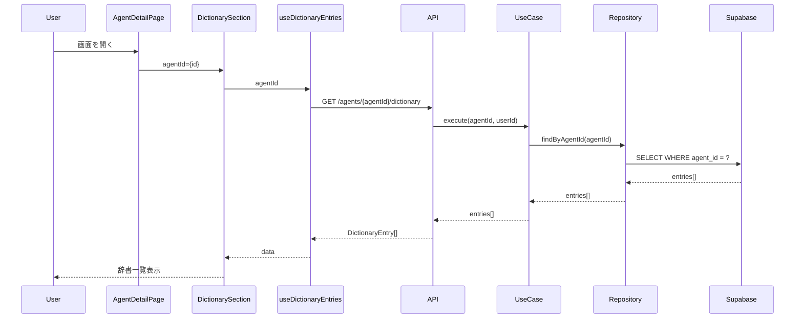

# 辞書機能のエージェント紐付け 設計書

## 概要

辞書機能をuser_id紐付けからagent_id紐付けに変更し、エージェント詳細画面に辞書管理セクションを追加する。これにより、各MTGエージェントに固有の用語辞書を持たせ、アジェンダ生成の精度を向上させる。

## 設計サマリー（メタ）

```yaml
design_type: "拡張"
risk_level: "中"
main_constraints:
  - "既存user_id紐付けの辞書データとの互換性"
  - "ADR-0001クリーンアーキテクチャ準拠"
  - "React 19ベストプラクティス準拠"
biggest_risks:
  - "既存データのマイグレーション失敗"
  - "APIレスポンス形式変更による既存画面への影響"
unknowns:
  - "aliases配列のUI最適解"
  - "カテゴリフィルタリングの実装優先度"
```

## 背景と経緯

### 前提となるADR

- **ADR-0001**: クリーンアーキテクチャ + DDD 採用 - ドメインエンティティ設計、層構造
- **ADR-0002**: 辞書機能のエージェント紐付け - 本設計の根拠

### 合意事項チェックリスト

#### スコープ

- [x] DBスキーマ: dictionary_entriesテーブルへのagent_id/category/aliasesカラム追加
- [x] バックエンドAPI: エンドポイントを`/api/v1/agents/{agent_id}/dictionary`に変更
- [x] フロントエンド: AgentDetailPageに辞書セクションを追加
- [x] 辞書フォーム: category/aliasesフィールドを追加

#### スコープ外（明示的に変更しないもの）

- [x] 既存DictionaryPage: 移行期間中は維持（段階的廃止）
- [x] 議事録正規化ロジック: 辞書取得先をagent_id経由に変更するが、正規化ロジック自体は変更しない
- [x] アジェンダ生成ロジック: 辞書取得先のみ変更

#### 制約

- [x] 並行運用: する（移行期間中は既存DictionaryPageも動作）
- [x] 後方互換性: 必要（agent_id=NULLの既存データをサポート）
- [x] パフォーマンス計測: 不要（MVP規模では問題なし）

### 解決すべき課題

1. 辞書エントリがエージェント単位で管理されていないため、アジェンダ生成時に不要な用語がコンテキストに含まれる
2. ユーザーがどの辞書エントリがどのMTGで使われているか把握困難
3. category/aliasesフィールドがなく、正規化精度が低い

### 現状の課題

- dictionary_entriesテーブルにuser_idのみ存在、agent_id未実装
- フロントエンドでAgentDetailPageと辞書機能が分離
- category/aliasesの情報がdescriptionに混在

### 要件

#### 機能要件

- エージェント詳細画面から辞書の作成・編集・削除が可能
- 辞書エントリにカテゴリ（人名/プロジェクト/用語/顧客/略語）を設定可能
- 辞書エントリに表記揺れ（aliases）を複数登録可能
- アジェンダ生成時に該当エージェントの辞書のみを使用

#### 非機能要件

- **パフォーマンス**: 辞書一覧取得は500ms以内（100件以下想定）
- **保守性**: クリーンアーキテクチャ準拠、カスタムフックでロジック分離
- **アクセシビリティ**: フォームにaria-label、キーボードナビゲーション対応

## 受入条件（AC）- EARS形式

### 辞書セクション表示

- [x] エージェント詳細画面を開いた時、システムは「辞書」セクションを議事録セクションの下に表示する
- [x] **When** 辞書エントリが0件の場合、システムは「辞書エントリがありません」と「辞書を追加」ボタンを表示する
- [x] **When** 辞書エントリが存在する場合、システムはカード形式で一覧表示する（正式名称、カテゴリ、表記揺れ数）

### 辞書作成

- [x] **When** 「辞書を追加」ボタンをクリックすると、システムは辞書作成モーダルを表示する
- [x] モーダルには正式名称（必須）、カテゴリ（必須）、表記揺れ（任意・複数）、説明（任意）フィールドが表示される
- [x] **When** 有効なデータで「作成」ボタンをクリックすると、システムはPOST APIを呼び出し、成功後にモーダルを閉じて一覧を更新する
- [x] **If** 正式名称が空の場合、**then** システムは「正式名称は必須です」エラーを表示する

### 辞書編集

- [x] **When** 辞書カードの「編集」ボタンをクリックすると、システムは編集モーダルを表示し、既存値をフォームに設定する
- [x] **When** 有効なデータで「更新」ボタンをクリックすると、システムはPUT APIを呼び出し、成功後にモーダルを閉じて一覧を更新する

### 辞書削除

- [x] **When** 辞書カードの「削除」ボタンをクリックすると、システムは確認ダイアログを表示する
- [x] **If** 確認ダイアログで「OK」をクリックした場合、**then** システムはDELETE APIを呼び出し、一覧から削除する

### 表記揺れ管理

- [x] **When** 表記揺れ入力フィールドでEnterまたはカンマを入力すると、システムはタグとして追加する
- [x] **When** タグの「x」ボタンをクリックすると、システムはそのタグを削除する

## 既存コードベース分析

### 実装パスマッピング

| 種別 | パス | 説明 |
|-----|-----|-----|
| 既存 | frontend/src/features/dictionary/DictionaryPage.tsx | 独立した辞書ページ（user_id紐付け） |
| 既存 | frontend/src/features/dictionary/DictionaryForm.tsx | 辞書作成/編集フォーム |
| 既存 | frontend/src/features/dictionary/hooks.ts | useDictionaryEntriesなどのカスタムフック |
| 既存 | frontend/src/features/dictionary/api.ts | /api/v1/dictionary呼び出し |
| 既存 | frontend/src/features/dictionary/types.ts | DictionaryEntry型定義 |
| 既存 | frontend/src/features/agents/AgentDetailPage.tsx | エージェント詳細画面（辞書セクション未実装） |
| 既存 | backend/src/presentation/api/v1/endpoints/dictionary.py | /api/v1/dictionary CRUD |
| 既存 | backend/src/domain/entities/dictionary_entry.py | ドメインエンティティ |
| 既存 | supabase/migrations/20260201011121_create_dictionary_entries_table.sql | DBスキーマ |
| 新規 | supabase/migrations/YYYYMMDD_add_agent_id_to_dictionary.sql | agent_id/category/aliases追加 |
| 新規 | frontend/src/features/dictionary/DictionarySection.tsx | AgentDetailPage内の辞書セクション |
| 新規 | frontend/src/features/dictionary/AgentDictionaryForm.tsx | agent_id紐付けの新フォーム |

### 統合ポイント（新規実装でも記載）

- **統合先**: AgentDetailPage
- **呼び出し方式**: DictionarySectionコンポーネントをAgentDetailPage内に配置、agentIdをpropsで渡す

### 類似コンポーネント検索結果

- `DictionaryPage.tsx` / `DictionaryForm.tsx`: 既存の辞書管理コンポーネント
- **判断**: 既存コンポーネントを拡張してagent_id対応とするのではなく、新規コンポーネント（DictionarySection, AgentDictionaryForm）を作成
- **根拠**: 既存はuser_id紐付けのスタンドアロンページ用。agent_id紐付けのセクションコンポーネントは責務が異なる

## 設計

### 変更影響マップ

```yaml
変更対象: 辞書機能全体（DB/API/フロントエンド）
直接影響:
  - supabase/migrations/: 新規マイグレーションファイル追加
  - backend/src/domain/entities/dictionary_entry.py: agent_id/category/aliasesフィールド追加
  - backend/src/presentation/schemas/dictionary.py: スキーマ更新
  - backend/src/presentation/api/v1/endpoints/dictionary.py: エンドポイント変更
  - frontend/src/features/dictionary/types.ts: 型定義更新
  - frontend/src/features/dictionary/api.ts: API呼び出し変更
  - frontend/src/features/dictionary/hooks.ts: agent_id対応
  - frontend/src/features/agents/AgentDetailPage.tsx: 辞書セクション追加
間接影響:
  - backend/src/infrastructure/services/normalization_service_impl.py: 辞書取得先変更
  - backend/src/infrastructure/services/agenda_generation_service.py: 辞書取得先変更
波及なし:
  - 議事録アップロード機能（正規化ロジックは変更なし）
  - Slack連携機能
  - アジェンダ生成ロジック（辞書取得先以外）
```

### アーキテクチャ概要

```mermaid
graph TD
    subgraph Frontend
        ADP[AgentDetailPage]
        DS[DictionarySection]
        ADF[AgentDictionaryForm]
        DH[useDictionaryEntries]
    end

    subgraph Backend
        API[/api/v1/agents/:agentId/dictionary]
        UC[DictionaryUseCases]
        REPO[DictionaryRepository]
        DB[(dictionary_entries)]
    end

    ADP --> DS
    DS --> ADF
    DS --> DH
    DH --> API
    API --> UC
    UC --> REPO
    REPO --> DB
```

### データフロー



### 統合ポイント一覧

| 統合ポイント | 箇所 | 旧実装 | 新実装 | 切替方式 |
|------------|-----|-------|-------|---------|
| 辞書取得 | DictionarySection | `/api/v1/dictionary` | `/api/v1/agents/{agentId}/dictionary` | 新規コンポーネント |
| 正規化時辞書取得 | normalization_service | user_idで取得 | agent_idで取得 | 引数追加 |
| アジェンダ生成時辞書取得 | agenda_generation_service | user_idで取得 | agent_idで取得 | 引数追加 |

### 主要コンポーネント

#### DictionarySection（新規）

- **責務**: AgentDetailPage内で辞書一覧の表示、作成/編集/削除のUI提供
- **インターフェース**:
  ```typescript
  type DictionarySectionProps = {
    agentId: string
  }
  ```
- **依存関係**: useDictionaryEntries, AgentDictionaryForm, Card, Button, EmptyState

#### AgentDictionaryForm（新規）

- **責務**: 辞書エントリの作成/編集モーダル
- **インターフェース**:
  ```typescript
  type AgentDictionaryFormProps = {
    agentId: string
    entry: DictionaryEntry | null
    onClose: () => void
  }
  ```
- **依存関係**: useCreateDictionaryEntry, useUpdateDictionaryEntry, Modal, Input, Button

### 型定義

```typescript
// frontend/src/features/dictionary/types.ts

export type DictionaryCategory =
  | 'person'
  | 'project'
  | 'term'
  | 'customer'
  | 'abbreviation'

export interface DictionaryEntry {
  id: string
  agent_id: string
  canonical_name: string
  category: DictionaryCategory
  aliases: string[]
  description: string | null
  created_at: string
  updated_at: string | null
}

export interface DictionaryEntryCreate {
  canonical_name: string
  category: DictionaryCategory
  aliases?: string[]
  description?: string | null
}

export interface DictionaryEntryUpdate {
  canonical_name?: string
  category?: DictionaryCategory
  aliases?: string[]
  description?: string | null
}
```

### データ契約

#### DictionarySection

```yaml
入力:
  型: { agentId: string }
  前提条件: agentIdはUUID形式、存在するエージェントID
  バリデーション: 空文字チェック

出力:
  型: JSX.Element（辞書一覧UI）
  保証: エージェントに紐付く辞書のみ表示
  エラー時: エラーアラート表示

不変条件:
  - 他エージェントの辞書は表示されない
  - RLSによりユーザー自身のエージェントの辞書のみアクセス可能
```

#### API: POST /api/v1/agents/{agent_id}/dictionary

```yaml
入力:
  型: DictionaryEntryCreate
  前提条件:
    - canonical_name: 1-100文字
    - category: 有効なカテゴリ値
    - aliases: 各要素1-100文字
    - description: 0-500文字

出力:
  型: DictionaryEntryResponse
  保証: 作成されたエントリにagent_idが設定される
  エラー時:
    - 409 Conflict: 同一agent_idで同一canonical_nameが存在
    - 404 Not Found: agent_idが存在しない
    - 401 Unauthorized: 認証エラー
```

### 統合ポイントマップ

```yaml
統合点1:
  既存コンポーネント: AgentDetailPage
  統合方法: DictionarySectionをchildとして配置
  影響度: 中（レンダリング追加）
  必要なテスト観点: セクション表示、レイアウト崩れなし

統合点2:
  既存コンポーネント: useDictionaryEntries
  統合方法: agentId引数を追加（オーバーロード）
  影響度: 中（API呼び出し先変更）
  必要なテスト観点: 正しいAPIエンドポイント呼び出し

統合点3:
  既存コンポーネント: normalization_service_impl
  統合方法: get_dictionary_entriesにagent_id引数追加
  影響度: 高（データフロー変更）
  必要なテスト観点: agent_id指定時は該当辞書のみ使用
```

### 統合境界契約

```yaml
DictionarySection -> useDictionaryEntries:
  入力(Props): agentId: string
  出力(Events): なし（データ取得のみ）
  エラー時: useQueryのerror stateで処理

AgentDictionaryForm -> useCreateDictionaryEntry:
  入力(Props): agentId: string, data: DictionaryEntryCreate
  出力(Events): onSuccess -> queryClient.invalidateQueries
  エラー時: try-catchでerror stateに設定、UI表示

API -> Supabase:
  入力: SQL with RLS
  出力: Row[]
  エラー時: HTTPException(503)
```

### エラーハンドリング

| エラー種別 | 発生箇所 | 対処 |
|-----------|---------|------|
| ネットワークエラー | API呼び出し | React Queryのエラー状態で「通信エラー」表示 |
| 認証エラー | API | 401を検知し、ログイン画面にリダイレクト |
| 重複エラー | 作成/更新API | 409を検知し、「同じ名前の辞書が存在します」表示 |
| Not Found | 更新/削除API | 404を検知し、一覧を再取得 |

### インターフェース変更影響分析

| 既存API | 新API | 変換必要 | ラッパー必要 | 互換性確保方法 |
|---------|-------|----------|------------|--------------|
| GET /api/v1/dictionary | GET /api/v1/agents/{agentId}/dictionary | あり | 必要 | 新エンドポイントを並行稼働 |
| POST /api/v1/dictionary | POST /api/v1/agents/{agentId}/dictionary | あり | 必要 | 新エンドポイントを並行稼働 |

## 実装計画

### 実装アプローチ

**選択したアプローチ**: 垂直スライス
**選択理由**:
- DB/API/フロントエンドが一体で動作する必要がある
- 各フェーズで動作確認可能なユーザー価値を提供
- 既存機能への影響を最小化しつつ段階的にリリース可能

### 技術的依存関係と実装順序

#### Phase 1: DBスキーマ変更

1. **マイグレーションファイル作成**
   - 技術的理由: API/フロントエンドがカラムに依存
   - 依存要素: なし（先行タスク）

2. **ドメインエンティティ更新**
   - 技術的理由: リポジトリがエンティティを使用
   - 前提条件: DBスキーマ確定

#### Phase 2: バックエンドAPI

3. **新エンドポイント実装**
   - 技術的理由: フロントエンドがAPIを呼び出す
   - 前提条件: ドメインエンティティ完成

4. **正規化サービス更新**
   - 技術的理由: 既存機能との整合性
   - 前提条件: リポジトリの新メソッド完成

#### Phase 3: フロントエンド

5. **型定義・API更新**
   - 技術的理由: コンポーネントが型を使用
   - 前提条件: APIスキーマ確定

6. **DictionarySection実装**
   - 技術的理由: AgentDetailPageが使用
   - 前提条件: hooks完成

7. **AgentDetailPage統合**
   - 技術的理由: 最終的なユーザー価値提供
   - 前提条件: DictionarySection完成

### 統合ポイント

各統合ポイントでE2E確認が必要：

**統合ポイント1: DBスキーマ -> リポジトリ**
- コンポーネント: マイグレーション -> DictionaryRepositoryImpl
- 確認方法: ローカルDBでINSERT/SELECT/UPDATE/DELETE実行
- 確認レベル: L1

**統合ポイント2: API -> フロントエンド**
- コンポーネント: /api/v1/agents/{agentId}/dictionary -> useDictionaryEntries
- 確認方法: ブラウザのNetwork DevToolsでAPIレスポンス確認
- 確認レベル: L1

**統合ポイント3: DictionarySection -> AgentDetailPage**
- コンポーネント: DictionarySection -> AgentDetailPage
- 確認方法: エージェント詳細画面で辞書セクション表示確認
- 確認レベル: L1

### 移行戦略

1. **並行運用期間**: 既存 `/api/v1/dictionary` と新 `/api/v1/agents/{agentId}/dictionary` を並行稼働
2. **既存データ**: agent_id=NULLのエントリは既存APIで引き続きアクセス可能
3. **段階的廃止**: MVP検証後、既存DictionaryPageを非推奨化

## テスト戦略

### 単体テスト

- **DictionarySection**:
  - 空状態表示
  - エントリ一覧表示
  - 編集/削除ボタン動作
- **AgentDictionaryForm**:
  - バリデーションエラー表示
  - 送信成功時のonClose呼び出し
  - aliases入力のタグ追加/削除

### 統合テスト

- **useDictionaryEntries + API**:
  - MSWでAPIモック
  - agentIdでのフィルタリング確認
  - 作成/更新/削除後のキャッシュ無効化

### E2Eテスト

- エージェント詳細画面で辞書を作成し、一覧に表示されることを確認
- 辞書を編集し、変更が反映されることを確認
- 辞書を削除し、一覧から消えることを確認

## セキュリティ考慮事項

- **RLSポリシー**: agent_id経由でuser_idを検証（agents.user_id = auth.uid()）
- **入力バリデーション**: canonical_name/aliases/descriptionの長さ制限
- **XSS対策**: ReactのエスケープでHTML出力を保護

## 代替案

### 代替案1: 既存DictionaryFormの拡張

- **概要**: DictionaryFormにagentId引数を追加して使い回す
- **メリット**: コード重複を削減
- **デメリット**: 責務が混在し、条件分岐が複雑化
- **不採用理由**: 新規コンポーネントのほうが保守性が高い

## リスクと対策

| リスク | 影響度 | 発生確率 | 対策 |
|-------|-------|---------|-----|
| 既存データのマイグレーション失敗 | 高 | 低 | agent_id=NULLを許容し、既存動作を維持 |
| APIレスポンス形式変更による画面崩れ | 中 | 中 | TypeScript型でコンパイル時検出、MSWテスト |
| aliases入力のUX悪化 | 低 | 中 | ユーザーテストで確認、改善イテレーション |

## 参考資料

- ADR-0001: クリーンアーキテクチャ + DDD 採用
- ADR-0002: 辞書機能のエージェント紐付け
- project-contextスキル: ユビキタス言語辞書のデータ構造

## References

- [React 19 Best Practices](https://dev.to/jay_sarvaiya_reactjs/react-19-best-practices-write-clean-modern-and-efficient-react-code-1beb) - カスタムフックパターン
- [React Design Patterns](https://www.telerik.com/blogs/react-design-patterns-best-practices) - Compound Componentパターン
- [React v19 Release Notes](https://react.dev/blog/2024/12/05/react-19) - 新機能とベストプラクティス

## 更新履歴

| 日付 | バージョン | 変更内容 | 作成者 |
|-----|-----------|---------|-------|
| 2026-02-01 | 1.0 | 初版作成 | AI |
