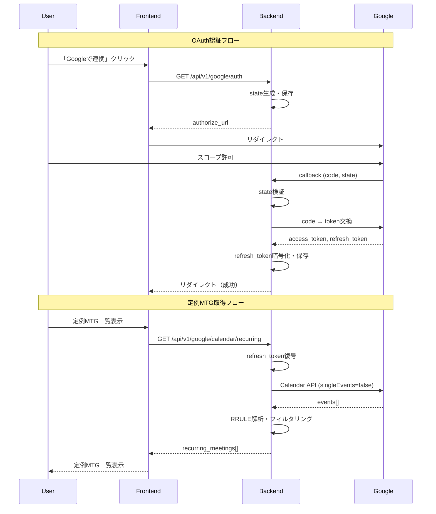

# Google Workspace連携機能 設計書

## 概要

Google Workspace連携機能を実装し、定例MTGの自動検出とMeetトランスクリプトの取得を実現する。これにより、コールドスタート問題を解消し、初回から価値を提供する。

## 設計サマリー（メタ）

```yaml
design_type: "新規機能"
risk_level: "高"
main_constraints:
  - "既存Slack連携パターンとの一貫性"
  - "ADR-0001クリーンアーキテクチャ準拠"
  - "Google API Services User Data Policy準拠"
biggest_risks:
  - "Google OAuth検証の遅延（公開審査が必要）"
  - "Meetトランスクリプトの形式変更への依存"
  - "レートリミット対応の複雑さ"
unknowns:
  - "トランスクリプトのファイル名形式（Googleが変更する可能性）"
  - "非正規定例の検出精度"
```

## 背景と経緯

### 前提となるADR

- **ADR-0001**: クリーンアーキテクチャ + DDD 採用 - ドメインエンティティ設計、層構造
- **ADR-0003**: Google Workspace連携の認証・トークン管理方式 - OAuth実装パターン

### 合意事項チェックリスト

#### スコープ

- [x] Google OAuth認証（Incremental Authorization対応）
- [x] Calendar API - 定例MTG自動検出（RRULE解析）
- [x] Drive API + Docs API - トランスクリプト取得
- [x] カレンダー↔トランスクリプト自動紐付け
- [x] DBスキーマ: 新規テーブル4つ（google_integrations, recurring_meetings, meeting_transcripts, generated_agendas）
  - **Note**: `generated_agendas`テーブルはPhase 1でスキーマのみ作成し、Phase 2のアジェンダ生成機能実装時にすぐ利用可能な状態にしておく（マイグレーションの分割を避け、関連テーブルを一括で作成する方針）

#### スコープ外（明示的に変更しないもの）

- [x] アジェンダ生成ロジック（Phase 1ではトランスクリプト取得まで。ただし`generated_agendas`テーブルは先行作成）
- [x] Slack連携の既存機能
- [x] Meet REST API v2（Phase 2で対応）
- [x] 非正規定例のヒューリスティック検出（Phase 2で対応）

#### 制約

- [x] 暗号化方式: Fernet継続（Slack連携と同一）
- [x] 認証実装: バックエンド直接実装（Supabase Authは使用しない）
- [x] MVPでは内部アプリ（テストユーザー100人まで）

### 解決すべき課題

1. **コールドスタート問題**: 新規エージェント作成時に過去の文脈がない
2. **定例MTGの手動登録**: ユーザーが手動で定例情報を入力する必要がある
3. **議事録の分散**: Google Docs、Slack、手動入力など複数ソースに分散

### 要件

#### 機能要件

- ユーザーがGoogleアカウントでログイン/連携できる
- Calendar APIから繰り返し予定を自動検出し、定例MTG候補として表示
- Google Meetのトランスクリプトを自動取得し、カレンダーイベントと紐付け
- 紐付けの信頼度が低い場合は手動確認をリクエスト

#### 非機能要件

- **パフォーマンス**: Calendar取得は3秒以内、トランスクリプト取得は5秒以内
- **セキュリティ**: RLSによるマルチテナント分離、トークンのFernet暗号化
- **可用性**: Google APIエラー時のグレースフルデグラデーション

## 受入条件（AC）- EARS形式

### Google OAuth認証

- [x] **When** ユーザーが「Googleで連携」ボタンをクリックすると、システムはGoogle OAuth認可画面にリダイレクトする
- [x] **When** ユーザーがGoogleでスコープを許可すると、システムはRefresh Tokenを暗号化して保存し、フロントエンドの成功画面にリダイレクトする
- [x] **If** ユーザーが認可をキャンセルした場合、**then** システムはエラー画面にリダイレクトする
- [x] **When** 既存の連携がある場合、システムはRefresh Tokenを更新する（新規作成ではなく）

### 定例MTG検出

- [x] **When** Google連携済みユーザーが定例MTG一覧画面を開くと、システムはCalendar APIから繰り返し予定を取得して表示する
- [x] システムは繰り返しルール（RRULE）を持つイベントのみを検出対象とする
- [x] システムは参加者2人以上のイベントのみを検出対象とする
- [x] システムは過去3ヶ月以内に実績のあるイベントのみを検出対象とする
- [x] **When** 定例MTGを選択すると、システムはエージェント作成画面に遷移し、会議名・参加者をプリセットする

### トランスクリプト取得

- [x] **When** 追加スコープ（drive.readonly, documents.readonly）が未許可の場合、システムはIncremental Authorization画面を表示する
- [x] **When** スコープが許可されている場合、システムはMeet Recordingsフォルダからトランスクリプトを検索する
- [x] システムはGoogle Docsからテキストコンテンツを取得し、話者・タイムスタンプ・発話内容を構造化する

### 紐付けロジック

- [x] システムはドキュメント名と会議名のマッチングを行う
- [x] システムはドキュメント作成日時とイベント日時を比較する（±24時間以内）
- [x] システムは参加者名とトランスクリプト内の話者名を照合する
- [x] **If** 信頼度スコアが閾値（0.7）以上の場合、**then** システムは自動紐付けを行う
- [x] **If** 信頼度スコアが閾値未満の場合、**then** システムは手動確認をリクエストする

## 既存コードベース分析

### 実装パスマッピング

| 種別 | パス | 説明 |
|-----|-----|-----|
| 参照 | backend/src/application/use_cases/slack_use_cases.py | OAuth実装パターンの参照 |
| 参照 | backend/src/infrastructure/external/encryption.py | トークン暗号化モジュール |
| 参照 | backend/src/presentation/api/v1/endpoints/slack.py | APIエンドポイントパターン |
| 新規 | backend/src/domain/entities/google_integration.py | Google連携エンティティ |
| 新規 | backend/src/domain/entities/recurring_meeting.py | 定例MTGエンティティ |
| 新規 | backend/src/domain/entities/meeting_transcript.py | トランスクリプトエンティティ |
| 新規 | backend/src/domain/entities/generated_agenda.py | 生成アジェンダエンティティ |
| 新規 | backend/src/domain/repositories/google_integration_repository.py | リポジトリインターフェース |
| 新規 | backend/src/domain/repositories/recurring_meeting_repository.py | リポジトリインターフェース |
| 新規 | backend/src/domain/repositories/meeting_transcript_repository.py | リポジトリインターフェース |
| 新規 | backend/src/infrastructure/repositories/google_integration_repository_impl.py | リポジトリ実装 |
| 新規 | backend/src/infrastructure/repositories/recurring_meeting_repository_impl.py | リポジトリ実装 |
| 新規 | backend/src/infrastructure/repositories/meeting_transcript_repository_impl.py | リポジトリ実装 |
| 新規 | backend/src/infrastructure/external/google_oauth_client.py | Google OAuthクライアント |
| 新規 | backend/src/infrastructure/external/google_calendar_client.py | Calendar APIクライアント |
| 新規 | backend/src/infrastructure/external/google_drive_client.py | Drive APIクライアント |
| 新規 | backend/src/infrastructure/external/google_docs_client.py | Docs APIクライアント |
| 新規 | backend/src/application/use_cases/google_auth_use_cases.py | 認証ユースケース |
| 新規 | backend/src/application/use_cases/calendar_use_cases.py | カレンダーユースケース |
| 新規 | backend/src/application/use_cases/transcript_use_cases.py | トランスクリプトユースケース |
| 新規 | backend/src/presentation/api/v1/endpoints/google.py | APIエンドポイント |
| 新規 | backend/src/presentation/schemas/google.py | リクエスト/レスポンススキーマ |
| 新規 | supabase/migrations/YYYYMMDD_create_google_integrations.sql | DBマイグレーション |
| 新規 | supabase/migrations/YYYYMMDD_create_recurring_meetings.sql | DBマイグレーション |
| 新規 | supabase/migrations/YYYYMMDD_create_meeting_transcripts.sql | DBマイグレーション |
| 新規 | supabase/migrations/YYYYMMDD_create_generated_agendas.sql | DBマイグレーション |
| 新規 | frontend/src/features/google/GoogleIntegrationPage.tsx | Google連携ページ |
| 新規 | frontend/src/features/google/RecurringMeetingList.tsx | 定例MTG一覧 |
| 新規 | frontend/src/features/google/TranscriptViewer.tsx | トランスクリプト表示 |
| 新規 | frontend/src/features/google/hooks.ts | カスタムフック |
| 新規 | frontend/src/features/google/api.ts | API呼び出し |
| 新規 | frontend/src/features/google/types.ts | 型定義 |

### 類似コンポーネント検索結果

- `slack_use_cases.py` / `slack.py`: OAuth認証パターン
- **判断**: Slack連携と同様のパターンで実装
- **根拠**: 既存の認証フロー、トークン管理、エンドポイント設計が参考になる

## 設計

### 変更影響マップ

```yaml
変更対象: Google Workspace連携機能全体
直接影響:
  - backend/src/domain/entities/: 新規エンティティ4つ
  - backend/src/domain/repositories/: 新規リポジトリインターフェース3つ
  - backend/src/infrastructure/external/: 新規クライアント4つ
  - backend/src/infrastructure/repositories/: 新規リポジトリ実装3つ
  - backend/src/application/use_cases/: 新規ユースケース3つ
  - backend/src/presentation/: 新規エンドポイント・スキーマ
  - backend/src/infrastructure/external/encryption.py: GOOGLE_TOKEN_ENCRYPTION_KEY対応追加
  - backend/src/config.py: Google OAuth設定追加
  - supabase/migrations/: 新規マイグレーション4つ
  - frontend/src/features/google/: 新規ディレクトリ
間接影響:
  - backend/src/presentation/api/v1/router.py: 新規ルーター登録
  - frontend/src/App.tsx: 新規ルート追加
波及なし:
  - Slack連携機能
  - 辞書機能
  - エージェント管理機能（データ連携は次フェーズ）
```

### アーキテクチャ概要

```mermaid
graph TD
    subgraph Frontend
        GIP[GoogleIntegrationPage]
        RML[RecurringMeetingList]
        TV[TranscriptViewer]
        GH[useGoogleIntegration]
    end

    subgraph Backend
        subgraph Presentation
            GAE[/api/v1/google/auth]
            GCE[/api/v1/google/calendar]
            GTE[/api/v1/google/transcripts]
        end

        subgraph Application
            GAUC[GoogleAuthUseCases]
            CUC[CalendarUseCases]
            TUC[TranscriptUseCases]
        end

        subgraph Domain
            GI[GoogleIntegration]
            RM[RecurringMeeting]
            MT[MeetingTranscript]
            REPO_IF[Repositories Interface]
        end

        subgraph Infrastructure
            GOC[GoogleOAuthClient]
            GCC[GoogleCalendarClient]
            GDC[GoogleDriveClient]
            GDOC[GoogleDocsClient]
            ENC[Encryption]
            REPO_IMPL[Repositories Impl]
            DB[(Supabase)]
        end
    end

    GIP --> GH
    RML --> GH
    TV --> GH
    GH --> GAE
    GH --> GCE
    GH --> GTE

    GAE --> GAUC
    GCE --> CUC
    GTE --> TUC

    GAUC --> GI
    GAUC --> REPO_IF
    CUC --> RM
    CUC --> REPO_IF
    TUC --> MT
    TUC --> REPO_IF

    REPO_IMPL --> REPO_IF
    REPO_IMPL --> DB
    GAUC --> GOC
    GAUC --> ENC
    CUC --> GCC
    TUC --> GDC
    TUC --> GDOC
```

### データフロー



### 主要コンポーネント

#### GoogleIntegration（ドメインエンティティ）

```python
@dataclass
class GoogleIntegration:
    id: UUID
    user_id: UUID
    email: str
    encrypted_refresh_token: str
    granted_scopes: list[str]
    created_at: datetime
    updated_at: datetime | None

    def has_scope(self, scope: str) -> bool:
        """指定スコープが許可済みか確認"""

    def add_scopes(self, new_scopes: list[str]) -> None:
        """スコープを追加（Incremental Authorization用）"""
```

#### RecurringMeeting（ドメインエンティティ）

```python
@dataclass
class RecurringMeeting:
    id: UUID
    user_id: UUID
    google_event_id: str
    title: str
    rrule: str
    frequency: MeetingFrequency  # WEEKLY, BIWEEKLY, MONTHLY
    attendees: list[Attendee]
    next_occurrence: datetime
    agent_id: UUID | None  # エージェントとの紐付け
    created_at: datetime
    updated_at: datetime | None

    def calculate_next_occurrence(self) -> datetime:
        """次回の開催日時を計算（dateutil.rrule使用）"""
```

#### MeetingTranscript（ドメインエンティティ）

```python
@dataclass
class MeetingTranscript:
    id: UUID
    recurring_meeting_id: UUID
    meeting_date: datetime
    google_doc_id: str
    raw_text: str
    structured_data: TranscriptStructuredData | None
    match_confidence: float  # 紐付け信頼度（0.0-1.0）
    created_at: datetime

@dataclass
class TranscriptStructuredData:
    entries: list[TranscriptEntry]

@dataclass
class TranscriptEntry:
    speaker: str
    timestamp: str
    text: str
```

### フロントエンド型定義（TypeScript）

```typescript
// frontend/src/features/google/types.ts

/** Google連携情報 */
export interface GoogleIntegration {
  id: string
  email: string
  granted_scopes: string[]
  created_at: string
  updated_at: string | null
}

/** 定例MTGの頻度 */
export type MeetingFrequency = 'weekly' | 'biweekly' | 'monthly'

/** 参加者情報 */
export interface Attendee {
  email: string
  name: string | null
}

/** 定例MTG */
export interface RecurringMeeting {
  id: string
  google_event_id: string
  title: string
  rrule: string
  frequency: MeetingFrequency
  attendees: Attendee[]
  next_occurrence: string
  agent_id: string | null
  created_at: string
  updated_at: string | null
}

/** トランスクリプトエントリ */
export interface TranscriptEntry {
  speaker: string
  timestamp: string
  text: string
}

/** 構造化トランスクリプトデータ */
export interface TranscriptStructuredData {
  entries: TranscriptEntry[]
}

/** 会議トランスクリプト */
export interface MeetingTranscript {
  id: string
  recurring_meeting_id: string
  meeting_date: string
  google_doc_id: string
  raw_text: string
  structured_data: TranscriptStructuredData | null
  match_confidence: number
  created_at: string
}

/** アジェンダステータス */
export type AgendaStatus = 'draft' | 'sent' | 'reviewed'

/** 生成アジェンダ */
export interface GeneratedAgenda {
  id: string
  recurring_meeting_id: string
  target_date: string
  agenda_content: Record<string, unknown>
  sources: Record<string, unknown>[]
  status: AgendaStatus
  delivered_via: string | null
  created_at: string
  updated_at: string | null
}

/** OAuth認証開始レスポンス */
export interface GoogleOAuthStartResponse {
  authorize_url: string
}

/** 定例MTG一覧取得レスポンス */
export type RecurringMeetingsResponse = RecurringMeeting[]

/** トランスクリプト一覧取得レスポンス */
export type MeetingTranscriptsResponse = MeetingTranscript[]
```

### データモデル

#### google_integrations

```sql
CREATE TABLE google_integrations (
    id UUID PRIMARY KEY DEFAULT gen_random_uuid(),
    user_id UUID NOT NULL REFERENCES auth.users(id) ON DELETE CASCADE,
    email TEXT NOT NULL,
    encrypted_refresh_token TEXT NOT NULL,
    granted_scopes TEXT[] NOT NULL DEFAULT '{}',
    created_at TIMESTAMPTZ NOT NULL DEFAULT NOW(),
    updated_at TIMESTAMPTZ,
    UNIQUE(user_id, email)
);

-- RLSポリシー
ALTER TABLE google_integrations ENABLE ROW LEVEL SECURITY;

CREATE POLICY google_integrations_user_policy ON google_integrations
    FOR ALL USING (auth.uid() = user_id);
```

#### recurring_meetings

```sql
CREATE TABLE recurring_meetings (
    id UUID PRIMARY KEY DEFAULT gen_random_uuid(),
    user_id UUID NOT NULL REFERENCES auth.users(id) ON DELETE CASCADE,
    google_event_id TEXT NOT NULL,
    title TEXT NOT NULL,
    rrule TEXT NOT NULL,
    frequency TEXT NOT NULL CHECK (frequency IN ('weekly', 'biweekly', 'monthly')),
    attendees JSONB NOT NULL DEFAULT '[]',
    next_occurrence TIMESTAMPTZ NOT NULL,
    agent_id UUID REFERENCES agents(id) ON DELETE SET NULL,
    created_at TIMESTAMPTZ NOT NULL DEFAULT NOW(),
    updated_at TIMESTAMPTZ,
    UNIQUE(user_id, google_event_id)
);

-- RLSポリシー
ALTER TABLE recurring_meetings ENABLE ROW LEVEL SECURITY;

CREATE POLICY recurring_meetings_user_policy ON recurring_meetings
    FOR ALL USING (auth.uid() = user_id);

-- インデックス
CREATE INDEX idx_recurring_meetings_user_id ON recurring_meetings(user_id);
CREATE INDEX idx_recurring_meetings_next_occurrence ON recurring_meetings(next_occurrence);
```

#### meeting_transcripts

```sql
CREATE TABLE meeting_transcripts (
    id UUID PRIMARY KEY DEFAULT gen_random_uuid(),
    recurring_meeting_id UUID NOT NULL REFERENCES recurring_meetings(id) ON DELETE CASCADE,
    meeting_date TIMESTAMPTZ NOT NULL,
    google_doc_id TEXT NOT NULL,
    raw_text TEXT NOT NULL,
    structured_data JSONB,
    match_confidence REAL NOT NULL DEFAULT 0.0,
    created_at TIMESTAMPTZ NOT NULL DEFAULT NOW(),
    UNIQUE(recurring_meeting_id, google_doc_id)
);

-- RLSポリシー（親テーブル経由でuser_id検証）
ALTER TABLE meeting_transcripts ENABLE ROW LEVEL SECURITY;

CREATE POLICY meeting_transcripts_user_policy ON meeting_transcripts
    FOR ALL USING (
        EXISTS (
            SELECT 1 FROM recurring_meetings rm
            WHERE rm.id = meeting_transcripts.recurring_meeting_id
            AND rm.user_id = auth.uid()
        )
    );

-- インデックス
CREATE INDEX idx_meeting_transcripts_recurring_meeting_id ON meeting_transcripts(recurring_meeting_id);
CREATE INDEX idx_meeting_transcripts_meeting_date ON meeting_transcripts(meeting_date);
```

#### generated_agendas

```sql
CREATE TABLE generated_agendas (
    id UUID PRIMARY KEY DEFAULT gen_random_uuid(),
    recurring_meeting_id UUID NOT NULL REFERENCES recurring_meetings(id) ON DELETE CASCADE,
    target_date TIMESTAMPTZ NOT NULL,
    agenda_content JSONB NOT NULL,
    sources JSONB NOT NULL DEFAULT '[]',
    status TEXT NOT NULL DEFAULT 'draft' CHECK (status IN ('draft', 'sent', 'reviewed')),
    delivered_via TEXT,
    created_at TIMESTAMPTZ NOT NULL DEFAULT NOW(),
    updated_at TIMESTAMPTZ
);

-- RLSポリシー（親テーブル経由でuser_id検証）
ALTER TABLE generated_agendas ENABLE ROW LEVEL SECURITY;

CREATE POLICY generated_agendas_user_policy ON generated_agendas
    FOR ALL USING (
        EXISTS (
            SELECT 1 FROM recurring_meetings rm
            WHERE rm.id = generated_agendas.recurring_meeting_id
            AND rm.user_id = auth.uid()
        )
    );
```

### APIエンドポイント

| メソッド | パス | 説明 |
|----------|------|------|
| GET | `/api/v1/google/auth` | OAuth認証URL取得 |
| GET | `/api/v1/google/callback` | OAuthコールバック |
| GET | `/api/v1/google/integrations` | Google連携一覧取得 |
| DELETE | `/api/v1/google/integrations/{id}` | Google連携削除 |
| GET | `/api/v1/google/auth/additional-scopes` | 追加スコープ認証URL取得 |
| GET | `/api/v1/google/calendar/recurring` | 定例MTG一覧取得 |
| POST | `/api/v1/google/calendar/recurring/{id}/sync` | 定例MTG同期 |
| GET | `/api/v1/google/transcripts` | トランスクリプト一覧取得 |
| POST | `/api/v1/google/transcripts/sync` | トランスクリプト同期 |
| POST | `/api/v1/google/transcripts/{id}/link` | 手動紐付け |

### 紐付けアルゴリズム

```python
def calculate_match_confidence(
    doc_name: str,
    doc_created: datetime,
    event_summary: str,
    event_datetime: datetime,
    event_attendees: list[str],
    transcript_speakers: list[str],
) -> float:
    """
    紐付け信頼度を計算する（0.0-1.0）

    スコア計算:
    - 会議名の類似度: 0.4 (Levenshtein距離)
    - 日時の近さ: 0.3 (±24時間以内で線形減衰)
    - 参加者の一致率: 0.3 (Jaccard係数)
    """
    score = 0.0

    # 会議名の類似度（0.4）
    name_similarity = calculate_string_similarity(doc_name, event_summary)
    score += name_similarity * 0.4

    # 日時の近さ（0.3）
    time_diff_hours = abs((doc_created - event_datetime).total_seconds() / 3600)
    if time_diff_hours <= 24:
        time_score = 1.0 - (time_diff_hours / 24)
        score += time_score * 0.3

    # 参加者の一致率（0.3）
    attendee_names = [extract_name(email) for email in event_attendees]
    attendee_match = calculate_jaccard(set(attendee_names), set(transcript_speakers))
    score += attendee_match * 0.3

    return score
```

### トランスクリプトパーサー

```python
import re

TRANSCRIPT_PATTERN = re.compile(
    r'^(?P<speaker>.+?)\s*\((?P<timestamp>\d{1,2}:\d{2})\)\s*$',
    re.MULTILINE
)

def parse_transcript(raw_text: str) -> list[TranscriptEntry]:
    """
    Google Meetトランスクリプトをパースする

    入力形式:
    ```
    宮木翔太 (10:02)
    じゃあ先週のタスクの進捗から確認しましょうか。

    金澤 (10:02)
    はい、RAGのチューニングは完了しました。
    ```
    """
    entries = []
    current_speaker = None
    current_timestamp = None
    current_text_lines = []

    for line in raw_text.split('\n'):
        match = TRANSCRIPT_PATTERN.match(line)
        if match:
            # 前の発話を保存
            if current_speaker:
                entries.append(TranscriptEntry(
                    speaker=current_speaker,
                    timestamp=current_timestamp,
                    text='\n'.join(current_text_lines).strip()
                ))
            # 新しい発話を開始
            current_speaker = match.group('speaker')
            current_timestamp = match.group('timestamp')
            current_text_lines = []
        elif line.strip():
            current_text_lines.append(line)

    # 最後の発話を保存
    if current_speaker:
        entries.append(TranscriptEntry(
            speaker=current_speaker,
            timestamp=current_timestamp,
            text='\n'.join(current_text_lines).strip()
        ))

    return entries
```

### エラーハンドリング

| エラー種別 | 発生箇所 | 対処 |
|-----------|---------|------|
| Invalid state | OAuthコールバック | 400 Bad Request、再認証を促す |
| Token expired | API呼び出し | 自動リフレッシュ、失敗時は再認証 |
| Rate limit | Google API | Exponential Backoff、最大5回リトライ |
| Insufficient scope | API呼び出し | Incremental Authorization画面を表示 |
| Meet Recordings not found | トランスクリプト取得 | 空リストを返却、ユーザーにガイダンス表示 |
| Parse error | トランスクリプト解析 | raw_textのみ保存、structured_dataはnull |

## 実装計画

### 実装アプローチ

**選択したアプローチ**: 垂直スライス
**選択理由**:
- OAuth認証が他の機能の前提条件
- 各機能が独立して価値を提供
- 段階的にリリース可能

### 技術的依存関係と実装順序

#### Phase 1-1: Google OAuth認証

1. **DBマイグレーション（google_integrations）**
   - 前提条件: なし
2. **ドメインエンティティ（GoogleIntegration）**
   - 前提条件: DBスキーマ確定
3. **リポジトリ（GoogleIntegrationRepository）**
   - 前提条件: エンティティ完成
4. **暗号化モジュール拡張**
   - 前提条件: なし
5. **Google OAuthクライアント**
   - 前提条件: 暗号化モジュール
6. **ユースケース（GoogleAuthUseCases）**
   - 前提条件: リポジトリ、OAuthクライアント
7. **APIエンドポイント**
   - 前提条件: ユースケース
8. **フロントエンド（GoogleIntegrationPage）**
   - 前提条件: APIエンドポイント

#### Phase 1-2: Calendar API - 定例MTG検出

1. **DBマイグレーション（recurring_meetings）**
2. **ドメインエンティティ（RecurringMeeting）**
3. **リポジトリ（RecurringMeetingRepository）**
4. **Google Calendarクライアント**
5. **RRULEパーサー（dateutil.rrule活用）**
6. **ユースケース（CalendarUseCases）**
7. **APIエンドポイント**
8. **フロントエンド（RecurringMeetingList）**

#### Phase 1-3: トランスクリプト取得

1. **DBマイグレーション（meeting_transcripts, generated_agendas）**
2. **ドメインエンティティ（MeetingTranscript, GeneratedAgenda）**
3. **リポジトリ**
4. **Google Drive/Docsクライアント**
5. **トランスクリプトパーサー**
6. **紐付けアルゴリズム**
7. **ユースケース（TranscriptUseCases）**
8. **APIエンドポイント**
9. **フロントエンド（TranscriptViewer）**

### 統合ポイント

**統合ポイント1: OAuth → Calendar**
- コンポーネント: GoogleIntegration → CalendarUseCases
- 確認方法: OAuth完了後にCalendar API呼び出しが成功
- 確認レベル: L1

**統合ポイント2: Calendar → Transcript**
- コンポーネント: RecurringMeeting → TranscriptUseCases
- 確認方法: 定例MTG選択後にトランスクリプト一覧が表示
- 確認レベル: L1

**統合ポイント3: Transcript → 紐付け**
- コンポーネント: MeetingTranscript → 紐付けアルゴリズム
- 確認方法: 信頼度スコアが正しく計算される
- 確認レベル: L1

## テスト戦略

### 単体テスト

- **GoogleIntegration**: スコープ管理、トークン更新
- **RecurringMeeting**: 次回日時計算（dateutil.rrule）
- **MeetingTranscript**: トランスクリプトパース
- **紐付けアルゴリズム**: 各スコア計算、閾値判定

### 統合テスト

- **OAuth フロー**: state生成→検証→トークン交換
- **Calendar API**: モックレスポンスでのRRULE解析
- **Drive/Docs API**: モックレスポンスでのトランスクリプト取得

### E2Eテスト

- Google連携の開始から完了まで
- 定例MTG一覧表示
- トランスクリプト取得と紐付け

## セキュリティ考慮事項

- **RLSポリシー**: 全テーブルでuser_id単位のアクセス制御
- **トークン暗号化**: Fernet（AES-128-CBC with HMAC）
- **state検証**: CSRF対策として必須
- **スコープ最小化**: Incremental Authorizationで必要時のみ追加
- **Google API Services User Data Policy**: Limited Use要件の遵守

## 代替案

### 代替案1: Supabase Auth + Google Provider

- **概要**: Supabaseの組み込みGoogle認証を使用
- **メリット**: 実装コスト低、設定のみで完了
- **デメリット**: Incremental Authorization非対応、スコープ固定
- **不採用理由**: Calendar/Drive APIに必要なスコープを柔軟に制御できない

### 代替案2: Meet REST API v2優先

- **概要**: Drive/Docs APIではなくMeet REST APIを先に実装
- **メリット**: 構造化されたトランスクリプトが取得可能
- **デメリット**: Meet REST APIはまだベータ版、安定性に懸念
- **不採用理由**: Phase 2で対応し、Phase 1はDrive/Docsで安定稼働を優先

## リスクと対策

| リスク | 影響度 | 発生確率 | 対策 |
|-------|-------|---------|-----|
| Google OAuth公開審査の遅延 | 高 | 中 | MVPでは内部アプリ（100ユーザーまで）で開発 |
| トランスクリプト形式の変更 | 中 | 低 | パーサーを疎結合に設計、フォールバック処理 |
| レートリミット超過 | 中 | 中 | Exponential Backoff、ユーザー単位のスロットリング |
| 紐付け精度の低さ | 中 | 中 | 手動確認フロー、フィードバックによる閾値調整 |
| Refresh Token失効 | 低 | 低 | 再認証フローの整備、ユーザー通知 |

## 参考資料

- [Google Calendar API - Recurring Events](https://developers.google.com/calendar/api/guides/recurringevents)
- [Google Drive API - Search for files](https://developers.google.com/drive/api/guides/search-files)
- [Google Docs API - Get document content](https://developers.google.com/docs/api/how-tos/documents)
- [Google Meet REST API - Transcripts](https://developers.google.com/meet/api/guides/artifacts)
- [ADR-0001: クリーンアーキテクチャ + DDD 採用](../adr/ADR-0001-clean-architecture-adoption.md)
- [ADR-0003: Google Workspace連携の認証・トークン管理方式](../adr/ADR-0003-google-workspace-auth.md)

## 更新履歴

| 日付 | バージョン | 変更内容 | 作成者 |
|-----|-----------|---------|-------|
| 2026-02-01 | 1.0 | 初版作成 | AI |
| 2026-02-01 | 1.1 | レビュー指摘対応: TypeScript型定義追加、generated_agendas作成意図明記 | AI |
