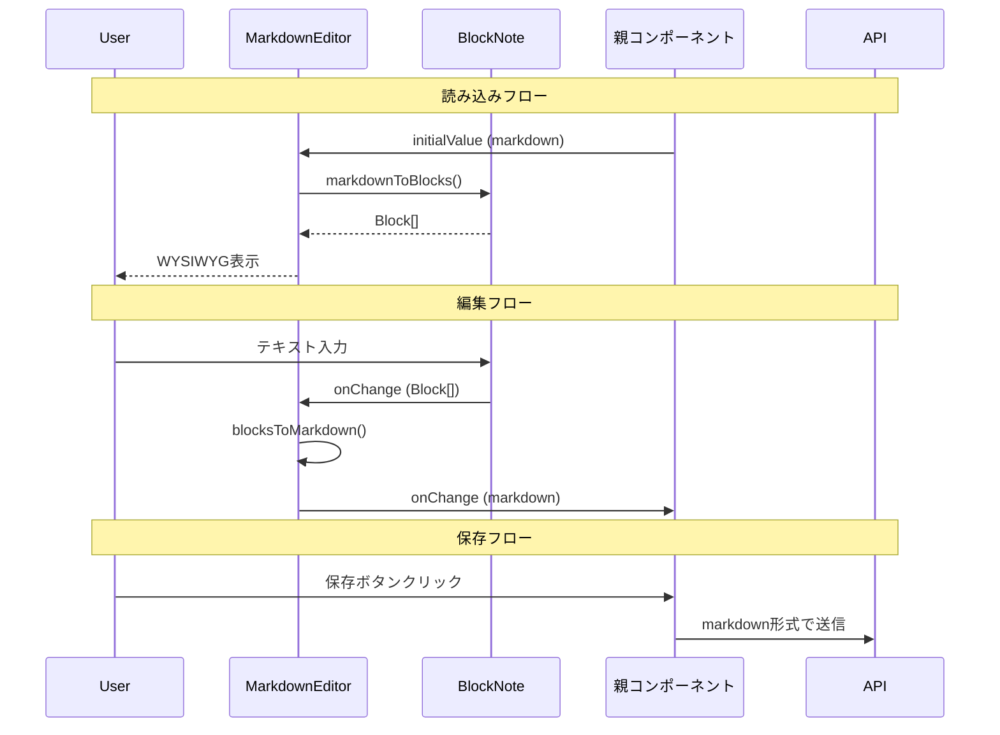

# マークダウンエディタ体験改善 設計書

## 概要

議事録入力とアジェンダ編集において、Notion風WYSIWYGエディタ体験を提供するためにBlockNoteライブラリを導入する。ADR-0006で選定されたBlockNoteを使用し、共通エディタコンポーネントを作成して統一的なUXを実現する。

## 設計サマリー（メタ）

```yaml
design_type: "拡張"
risk_level: "中"
main_constraints:
  - "React 19 StrictMode非互換（開発環境のみ）"
  - "バンドルサイズ増加（約150KB gzip）"
  - "既存のマークダウンデータ形式との互換性維持"
biggest_risks:
  - "StrictMode無効化による開発体験への影響"
  - "BlockNote独自スタイルとデザインシステムの競合"
unknowns:
  - "Shikiなしでのコードブロック表示挙動"
  - "大量テキスト時のパフォーマンス"
```

## 背景と経緯

### 前提となるADR

- [ADR-0006: Notion風WYSIWYGマークダウンエディタライブラリの選定](../adr/ADR-0006-markdown-editor-library.md): BlockNoteを採用決定。React 19 StrictMode非互換は開発環境のみ影響、本番は正常動作。

### 合意事項チェックリスト

#### スコープ
- [x] AgendaEditor.tsx のWYSIWYG化
- [x] MeetingNoteUpload.tsx の議事録入力フィールドのWYSIWYG化
- [x] 共通BlockNoteエディタコンポーネントの作成
- [x] 大きめの入力ボックス（最小高さ400px）

#### スコープ外（明示的に変更しないもの）
- [x] TranscriptViewer.tsx（閲覧専用、編集機能なし）
- [x] 既存のAPI・バックエンドロジック
- [x] データベーススキーマ
- [x] 他のフォーム入力コンポーネント

#### 制約
- [x] 並行運用: しない（一括移行）
- [x] 後方互換性: 必要（マークダウン形式での保存を維持）
- [x] パフォーマンス計測: 不要（MVP段階）

### 解決すべき課題

ユーザーが議事録やアジェンダを編集する際、マークダウン記法を直接入力する必要があり、プレビューと編集が分離している。「Notionのように入力しながらリアルタイムでスタイルが適用されるWYSIWYG体験」が求められている。

### 現状の課題

1. **AgendaEditor.tsx**: プレビュー/編集モードの切り替えが必要。Textarea + プレーンテキスト表示。
2. **MeetingNoteUpload.tsx**: 単純なtextarea。マークダウン記法のプレビュー機能なし。
3. **入力ボックスが小さい**: 現状のtextareaは15-16行程度で、長文編集が困難。

### 要件

#### 機能要件

- Notion風WYSIWYGエディタ体験（スラッシュメニュー、フローティングツールバー）
- リアルタイムのスタイル適用（見出し、箇条書き、番号リスト）
- 大きめの入力ボックス（最小高さ400px）
- マークダウン形式での保存・読み込み（既存データ互換性）

#### 非機能要件

- **パフォーマンス**: 入力時のラグなし（体感100ms以内）
- **バンドルサイズ**: 遅延読み込みで初期ロードへの影響最小化
- **保守性**: 共通コンポーネント化による一貫性確保
- **アクセシビリティ**: キーボード操作可能

## 受入条件（AC）- EARS形式

### エディタ基本動作

- [ ] **When** ユーザーがエディタにテキストを入力すると、リアルタイムでコンテンツが表示される
  - **Property**: `data-testid="markdown-editor"`が存在すること
- [ ] **When** ユーザーが「/」を入力すると、スラッシュメニューが表示される
  - **Property**: `[data-slash-menu]`または`.bn-slash-menu`が表示されること
- [ ] **When** ユーザーがテキストを選択すると、フローティングツールバーが表示される
  - **Property**: `.bn-formatting-toolbar`が表示されること
- [ ] **If** エディタ高さが400px未満の場合、**then** 最小高さ400pxが適用される
  - **Property**: `editorContainer.minHeight >= 400`

### 見出し・リスト操作

- [ ] **When** スラッシュメニューから「Heading 1」を選択すると、h1見出しが挿入される
- [ ] **When** スラッシュメニューから「Bullet List」を選択すると、箇条書きリストが開始される
- [ ] **When** スラッシュメニューから「Numbered List」を選択すると、番号付きリストが開始される

### データ変換

- [ ] **When** 保存ボタンがクリックされると、エディタ内容がマークダウン形式に変換されて保存される
- [ ] **When** 既存のマークダウンデータを読み込むと、BlockNote形式に変換されてエディタに表示される
- [ ] マークダウン→BlockNote→マークダウンの変換で、基本的なフォーマット（見出し（h1〜h3）、太字、箇条書き、番号リスト）が保持される

### アジェンダ編集（AgendaEditor）

- [ ] **When** アジェンダ編集画面を開くと、BlockNoteエディタが表示される
- [ ] **When** 「保存する」ボタンをクリックすると、マークダウン形式で保存される
- [ ] プレビュー/編集モード切り替えは不要（WYSIWYG）

### 議事録アップロード（MeetingNoteUpload）

- [ ] **When** 議事録アップロードフォームを開くと、BlockNoteエディタが表示される
- [ ] **When** 「アップロード」ボタンをクリックすると、マークダウン形式で送信される

## 既存コードベース分析

### 実装パスマッピング

> **注**: パスは全て `frontend/src/` からの相対パスです。

| 種別 | パス | 説明 |
|-----|-----|-----|
| 既存 | `components/ui/Input.tsx` | Textareaコンポーネント（共通UI） |
| 既存 | `features/agendas/AgendaEditor.tsx` | アジェンダ編集（プレビュー/編集モード切替） |
| 既存 | `features/meeting-notes/MeetingNoteUpload.tsx` | 議事録アップロード（textarea使用） |
| 既存 | `index.css` | デザインシステム（CSS Variables） |
| 既存 | `main.tsx` | アプリエントリー（StrictMode有効） |
| 新規 | `components/editor/MarkdownEditor.tsx` | 共通BlockNoteエディタコンポーネント |
| 新規 | `components/editor/index.ts` | エディタモジュールエクスポート |

### 類似機能の検索結果

- **リッチテキストエディタ**: 既存実装なし
- **WYSIWYG**: 既存実装なし
- **BlockNote**: 既存実装なし

→ **判断**: 新規実装を進める

### 統合ポイント（新規実装でも記載）

- **統合先1**: AgendaEditor.tsx - Textarea置換
- **統合先2**: MeetingNoteUpload.tsx - textarea置換
- **呼び出し方式**: Reactコンポーネントとしてインポート、props経由でvalue/onChangeを受け渡し

## 設計

### 変更影響マップ

```yaml
変更対象: マークダウン入力体験
直接影響:
  - src/components/editor/MarkdownEditor.tsx（新規作成）
  - src/features/agendas/AgendaEditor.tsx（Textarea→MarkdownEditor）
  - src/features/meeting-notes/MeetingNoteUpload.tsx（textarea→MarkdownEditor）
  - src/main.tsx（StrictMode削除）
  - package.json（@blocknote依存追加）
間接影響:
  - バンドルサイズ増加（約150KB gzip）
  - 初期ロード時間（遅延読み込みで軽減）
波及なし:
  - API・バックエンド
  - データベーススキーマ
  - 他のUIコンポーネント
  - TranscriptViewer.tsx
```

### アーキテクチャ概要

```mermaid
graph TD
    subgraph "共通コンポーネント層"
        ME[MarkdownEditor]
    end

    subgraph "機能コンポーネント層"
        AE[AgendaEditor]
        MU[MeetingNoteUpload]
    end

    subgraph "外部ライブラリ"
        BN[@blocknote/react]
        BC[@blocknote/core]
    end

    AE --> ME
    MU --> ME
    ME --> BN
    BN --> BC
```

### データフロー



### 統合ポイント一覧

| 統合ポイント | 箇所 | 旧実装 | 新実装 | 切替方式 |
|------------|-----|-------|-------|---------|
| アジェンダ編集 | AgendaEditor.tsx | Textarea + プレビューモード | MarkdownEditor（WYSIWYG） | コンポーネント置換 |
| 議事録入力 | MeetingNoteUpload.tsx | HTMLのtextarea | MarkdownEditor（WYSIWYG） | コンポーネント置換 |
| StrictMode | main.tsx | StrictMode有効 | StrictMode削除 | 直接編集 |

### 主要コンポーネント

#### MarkdownEditor（新規）

- **責務**: BlockNoteをラップした共通WYSIWYGエディタ
- **インターフェース**:
  ```typescript
  interface MarkdownEditorProps {
    initialValue?: string        // 初期値（マークダウン形式）
    onChange?: (markdown: string) => void  // 変更コールバック
    placeholder?: string         // プレースホルダー
    minHeight?: number           // 最小高さ（デフォルト400px）
    readOnly?: boolean           // 読み取り専用
  }
  ```
- **依存関係**: @blocknote/react, @blocknote/core

#### AgendaEditor（既存・変更）

- **責務**: アジェンダの編集・保存UI
- **変更内容**:
  - Textareaを MarkdownEditor に置換
  - プレビュー/編集モード切り替えを削除（WYSIWYG化）
  - isEditingステート削除
- **依存関係**: MarkdownEditor, hooks, types

#### MeetingNoteUpload（既存・変更）

- **責務**: 議事録テキストのアップロードフォーム
- **変更内容**: textareaを MarkdownEditor に置換
- **依存関係**: MarkdownEditor, hooks

### 型定義

```typescript
// src/components/editor/types.ts

import type { BlockNoteEditor } from '@blocknote/core'

export interface MarkdownEditorProps {
  /** 初期値（マークダウン形式） */
  initialValue?: string
  /** 変更時コールバック */
  onChange?: (markdown: string) => void
  /** プレースホルダーテキスト */
  placeholder?: string
  /** 最小高さ（px） */
  minHeight?: number
  /** 読み取り専用モード */
  readOnly?: boolean
  /** エディタインスタンスへの参照 */
  editorRef?: React.RefObject<BlockNoteEditor | null>
}
```

### データ契約

#### MarkdownEditor

```yaml
入力:
  型: MarkdownEditorProps
  前提条件:
    - initialValue: 有効なマークダウン文字列またはundefined
    - minHeight: 正の数値またはundefined（デフォルト400）
  バリデーション: 不要（BlockNoteが内部で処理）

出力:
  型: string（onChangeコールバック経由）
  保証:
    - 常に有効なマークダウン文字列
    - 空の場合は空文字列
  エラー時: onChangeは呼ばれない

不変条件:
  - マークダウン→BlockNote→マークダウンの変換で基本フォーマット保持
  - 見出し（h1-h3）、箇条書き、番号リストが保持される
```

### エラーハンドリング

| エラー種別 | 発生条件 | 対処 |
|----------|---------|-----|
| マークダウンパースエラー | 不正なマークダウン入力 | BlockNoteがフォールバック処理、ログ出力なし |
| BlockNote初期化エラー | ライブラリ読み込み失敗 | React Suspenseでフォールバック表示 |
| onChange実行エラー | 親コンポーネントのハンドラ例外 | 上位でキャッチ、エディタ動作継続 |

### ロギングとモニタリング

MVP段階のため、以下のみ実施:
- console.errorでの例外出力（開発時のみ）
- 本番環境でのロギングは不要

## 実装計画

### 実装アプローチ

**選択したアプローチ**: 垂直スライス（機能駆動）
**選択理由**:
- 機能間の依存が少なく、共通コンポーネント作成後は各機能を独立して実装可能
- 各統合ポイントでユーザーが利用可能な形で検証できる
- MVP開発フェーズで迅速な価値提供が重要

### 技術的依存関係と実装順序

#### 必要な実装順序

1. **StrictMode削除とBlockNote依存追加**
   - 技術的理由: BlockNoteがStrictModeと非互換のため、先行して対応が必要
   - 依存要素: 全てのBlockNote使用箇所

2. **MarkdownEditorコンポーネント作成**
   - 技術的理由: 共通コンポーネントがないと各機能での利用不可
   - 前提条件: StrictMode削除完了

3. **AgendaEditor統合**
   - 技術的理由: アジェンダ生成がコア機能（F5）のため優先
   - 前提条件: MarkdownEditor作成完了

4. **MeetingNoteUpload統合**
   - 技術的理由: AgendaEditor統合で動作確認後に実施
   - 前提条件: MarkdownEditor作成完了、AgendaEditor統合完了

### 統合ポイント

各統合ポイントでE2E確認が必要:

**統合ポイント1: MarkdownEditor単体動作**
- コンポーネント: MarkdownEditor
- 確認方法: Storybookまたは開発サーバーで直接表示し、入力・変換動作を確認

**統合ポイント2: AgendaEditor統合**
- コンポーネント: AgendaEditor -> MarkdownEditor
- 確認方法: アジェンダ生成→編集→保存のフローを実行し、保存データがマークダウン形式であることを確認

**統合ポイント3: MeetingNoteUpload統合**
- コンポーネント: MeetingNoteUpload -> MarkdownEditor
- 確認方法: 議事録アップロードフローを実行し、API送信データがマークダウン形式であることを確認

### 移行戦略

- **一括移行**: 段階的移行ではなく、一度に全箇所を移行
- **後方互換性**: マークダウン形式での保存を維持するため、既存データとの互換性を確保
- **ロールバック**: StrictMode再有効化とBlockNote削除で元に戻せる

## テスト戦略

### 単体テスト

- **MarkdownEditor**: マークダウン変換の正確性テスト
  - マークダウン→BlockNote→マークダウンの往復変換
  - 見出し、箇条書き、番号リストの保持確認
- **対象ファイル**: `src/components/editor/MarkdownEditor.test.tsx`
- **カバレッジ目標**: 70%以上

### 統合テスト

- **AgendaEditor**: 既存の統合テスト（agendas.int.test.tsx）を更新
  - エディタ入力→保存フローの検証
- **MeetingNoteUpload**: 既存の統合テスト（meeting-notes.int.test.tsx）を更新
  - エディタ入力→アップロードフローの検証

### E2Eテスト

MVP段階のため、手動テストで代替:
- [ ] アジェンダ生成→編集→保存の一連フロー
- [ ] 議事録入力→アップロードの一連フロー
- [ ] マークダウン記法（見出し、リスト）の動作確認

## セキュリティ考慮事項

- **XSS対策**: BlockNoteは内部でサニタイズ処理を行う。マークダウン出力時も自動エスケープされる。
- **入力検証**: バックエンドでの既存バリデーションを維持（変更なし）

## 代替案

### 代替案1: TipTapの直接使用

- **概要**: BlockNoteの基盤であるTipTapを直接使用
- **メリット**: より細かいカスタマイズが可能、バンドルサイズ小さい
- **デメリット**: Notion風UIを自前実装する必要があり、工数5-7日
- **不採用理由**: ADR-0006で工数削減を優先しBlockNoteを選定済み

### 代替案2: StrictMode維持

- **概要**: BlockNoteをStrictMode対応まで待機、または別ライブラリ検討
- **メリット**: 開発時のデバッグ支援機能を維持
- **デメリット**: 対応時期未定、他ライブラリは工数増
- **不採用理由**: StrictModeは開発支援機能であり本番品質に影響なし

## リスクと対策

| リスク | 影響度 | 発生確率 | 対策 |
|-------|-------|---------|-----|
| React 19 StrictMode非互換 | 中 | 確実 | main.tsxでStrictMode削除。開発環境のみの影響で本番は正常動作。BlockNote Issue #2106で修正進行中。 |
| バンドルサイズ増加 | 中 | 確実 | 遅延読み込み（React.lazy）で初期ロードへの影響最小化。コードブロック機能無効化でShiki除外。 |
| BlockNote独自スタイルとデザインシステムの競合 | 低 | 中 | CSS変数のオーバーライドで対応。必要に応じてスコープ付きスタイル適用。 |
| 大量テキスト時のパフォーマンス劣化 | 低 | 低 | MVP段階では許容。問題発生時に仮想化やチャンク分割を検討。 |

## 参考資料

- [ADR-0006: Notion風WYSIWYGマークダウンエディタライブラリの選定](../adr/ADR-0006-markdown-editor-library.md)
- [BlockNote公式ドキュメント](https://www.blocknotejs.org/)
- [BlockNote GitHub - React 19 StrictMode Issue](https://github.com/TypeCellOS/BlockNote/issues/1021)
- [BlockNote with Next.js - StrictMode workaround](https://www.blocknotejs.org/docs/getting-started/nextjs)
- [React Strict Mode Explained for 2026](https://javascript.plainenglish.io/react-strict-mode-explained-for-2026-5fca1c3fa786)

## 更新履歴

| 日付 | バージョン | 変更内容 | 作成者 |
|-----|-----------|---------|-------|
| 2026-02-03 | 1.0 | 初版作成 | AI Assistant |
