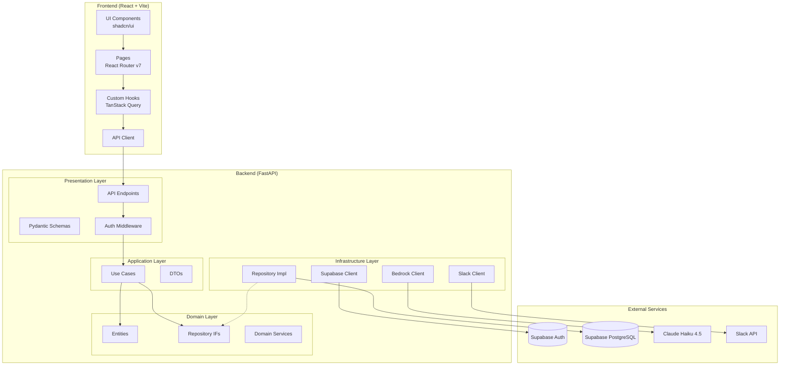
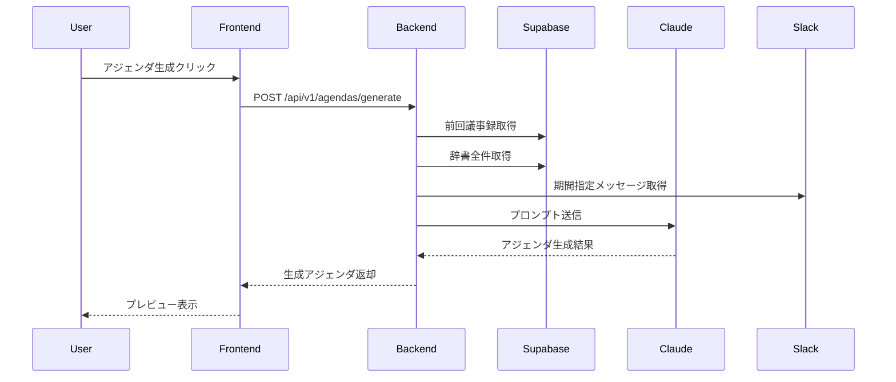
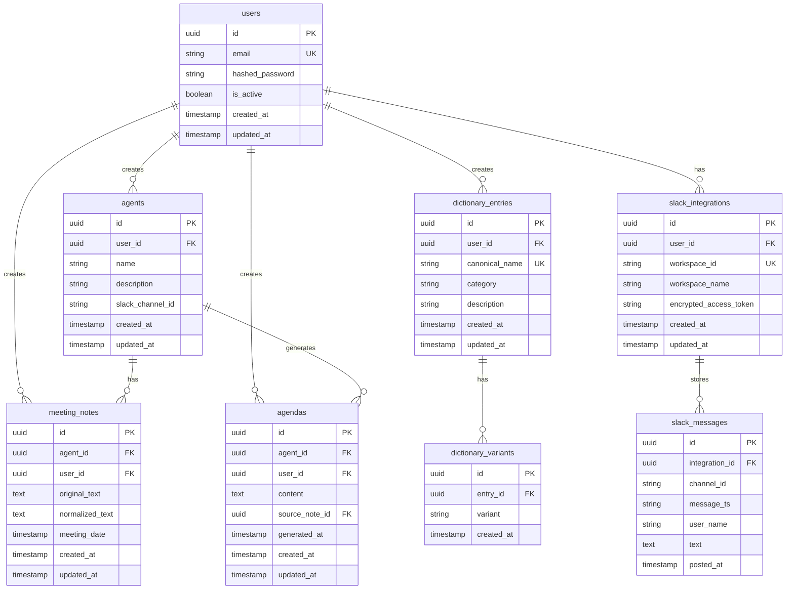

# Shitaku.ai MVP コア機能 設計書

## 概要

Shitaku.ai MVP（P0）の5つのコア機能を統合的に設計する。MTGエージェント管理、ユビキタス言語辞書、議事録アップロード+正規化、Slack連携、アジェンダ自動生成を実装し、PM・EMの定例MTG準備工数を削減する。

## 設計サマリー（メタ）

```yaml
design_type: "新機能"
risk_level: "中"
main_constraints:
  - "コストゼロ運用（Supabase無料枠 + AWS Activateクレジット）"
  - "Supabase無料枠: 500MB DB、50,000 MAU、500MB Storage"
  - "クリーンアーキテクチャ + DDD準拠（ADR-0001）"
  - "MVP検証対象: 5-10人のPM・EM"
biggest_risks:
  - "LLM APIコスト超過（AWS Activateクレジット枯渇）"
  - "Slack OAuth認証フローの複雑性"
  - "議事録正規化の精度（固有名詞の誤変換）"
unknowns:
  - "Slack API Rate Limit下での大量メッセージ取得"
  - "正規化処理の最適なプロンプト設計"
  - "アジェンダ生成の品質評価基準"
```

## 背景と経緯

### 前提となるADR

- **ADR-0001**: クリーンアーキテクチャ + DDD 採用 (Accepted)
  - 4層構造（domain/application/infrastructure/presentation）
  - 依存性の方向: `presentation -> application -> domain <- infrastructure`
  - ドメイン層は外部依存なし

### 合意事項チェックリスト

#### スコープ
- [x] F1: MTGエージェント管理（CRUD）
- [x] F2: 議事録アップロード + 正規化
- [x] F3: ユビキタス言語辞書（CRUD）
- [x] F4: Slack連携（OAuth + メッセージ取得）
- [x] F5: アジェンダ自動生成

#### スコープ外（明示的に変更しないもの）
- [ ] ベクトル検索（pgvector）- P1で実装
- [ ] 複数組織対応 - P1で実装
- [ ] リアルタイム通知 - P1で実装
- [ ] 議事録のリッチテキスト編集 - P1で実装

#### 制約
- [x] 並行運用: しない（新規開発）
- [x] 後方互換性: 不要（MVPのため）
- [x] パフォーマンス計測: 必要（LLM API応答時間）

### 解決すべき課題

1. **MTGアジェンダ準備の煩雑さ**: 前回議事録の確認、Slack履歴の収集、アジェンダ作成に時間がかかる
2. **文脈の喪失**: 文字起こしの固有名詞ブレにより、過去のMTG内容が検索・参照しづらい
3. **情報の分散**: 議事録とSlack履歴が別々に管理され、横断的な把握が困難

### 現状の課題

- 既存のNotebookLM検証で、固有名詞の表記揺れが致命的な問題と判明
- ユビキタス言語辞書による正規化なしでは実用不可

### 要件

#### 機能要件

1. **MTGエージェント**: 定例MTGシリーズごとにエージェントを作成・管理
2. **ユビキタス言語辞書**: 人名・プロジェクト・用語・顧客・略語の登録と表記揺れ管理
3. **議事録管理**: テキストアップロード、辞書による正規化、DB保存
4. **Slack連携**: OAuth認証、チャンネル選択、期間指定メッセージ取得
5. **アジェンダ生成**: 前回議事録 + Slack履歴 + 辞書を元にClaudeで生成

#### 非機能要件

- **パフォーマンス**: アジェンダ生成 30秒以内
- **スケーラビリティ**: 初期は5-10人対応、将来的に100人まで
- **信頼性**: 正規化失敗時のフォールバック（元テキスト保持）
- **保守性**: クリーンアーキテクチャに準拠したコード構造

## 受入条件（AC）- EARS形式

### F1: MTGエージェント管理

- [ ] **When** ユーザーがエージェント作成フォームにMTG名と説明を入力して保存すると、システムはエージェントをDBに保存しリストに表示する
  - **Property**: `agents.count == previous_count + 1`
- [ ] **When** ユーザーがエージェント一覧画面を開くと、システムは自分が作成したエージェントのリストを表示する
- [ ] **When** ユーザーがエージェントを編集して保存すると、システムは変更内容をDBに反映する
- [ ] **When** ユーザーがエージェントを削除すると、システムは関連する議事録・アジェンダも含めて削除する
- [ ] **If** エージェント名が空の場合、**then** システムはバリデーションエラーを表示する

### F2: ユビキタス言語辞書

- [ ] **When** ユーザーが辞書エントリ作成フォームに正式名称・カテゴリ・表記揺れを入力して保存すると、システムはエントリをDBに保存する
  - **Property**: `dictionary_entries.count == previous_count + 1`
- [ ] **When** ユーザーが辞書一覧画面でカテゴリフィルタを選択すると、システムは該当カテゴリのエントリのみを表示する
  - **Property**: `displayed.every(entry => entry.category == selected_category)`
- [ ] **When** ユーザーが辞書エントリを編集して保存すると、システムは変更内容をDBに反映する
- [ ] **When** ユーザーが辞書エントリを削除すると、システムはエントリと関連する表記揺れを削除する
- [ ] **If** 正式名称が既存エントリと重複する場合、**then** システムはエラーメッセージを表示する
- [ ] システムは以下の5カテゴリを選択肢として提供する: 人名、プロジェクト、用語、顧客、略語

### F3: 議事録アップロード + 正規化

- [ ] **When** ユーザーがエージェントを選択して議事録テキストをアップロードすると、システムは辞書を参照して固有名詞を正規化し、DBに保存する
  - **Property**: `meeting_notes.count == previous_count + 1`
- [ ] **When** 正規化処理が完了すると、システムは正規化前後のテキストを比較表示する
- [ ] **If** 正規化処理でLLM APIエラーが発生した場合、**then** システムは元テキストをそのまま保存し、ユーザーに警告を表示する
- [ ] **When** ユーザーが議事録一覧画面を開くと、システムは選択中エージェントの議事録を日付降順で表示する
- [ ] **When** ユーザーが議事録を削除すると、システムはDBから該当レコードを削除する

### F4: Slack連携

- [ ] **When** ユーザーがSlack連携ボタンをクリックすると、システムは一意のstateパラメータを生成しセッションに保存した上で、Slack OAuth画面にリダイレクトする
- [ ] **When** SlackからOAuthコールバックを受信すると、システムはstateパラメータを検証しCSRF攻撃を防止する
  - **Property**: `callback_state == session_state`
  - **If** stateが一致しない場合、**then** システムは400エラーを返却し認証処理を中止する
- [ ] **When** ユーザーがSlackワークスペースを認可すると、システムはアクセストークンを暗号化してDBに保存する
- [ ] **When** ユーザーがSlack連携設定画面を開くと、システムは連携済みワークスペースとチャンネル一覧を表示する
- [ ] **When** ユーザーがエージェントにSlackチャンネルを紐付けると、システムは紐付け情報をDBに保存する
- [ ] **If** Slackトークンが無効になった場合、**then** システムは再認証を促すメッセージを表示する
- [ ] **When** システムがSlackメッセージを取得すると、前回MTG日時から現在までの期間のメッセージを取得する
  - **Property**: `messages.every(m => m.timestamp >= last_meeting_date)`

### F5: アジェンダ自動生成

- [ ] **When** ユーザーがエージェント詳細画面で「アジェンダ生成」ボタンをクリックすると、システムは前回議事録・Slack履歴・辞書を収集してClaudeでアジェンダを生成する
- [ ] **When** アジェンダ生成が完了すると、システムは生成されたアジェンダをプレビュー表示する
  - **Property**: `response_time <= 30000ms`
- [ ] **When** ユーザーがアジェンダを保存すると、システムはアジェンダをDBに保存する
- [ ] **When** ユーザーがアジェンダを編集して保存すると、システムは変更内容をDBに反映する
- [ ] **If** 前回議事録が存在しない場合、**then** システムはSlack履歴のみでアジェンダを生成する
- [ ] **If** Slack連携が設定されていない場合、**then** システムは前回議事録のみでアジェンダを生成する

## 既存コードベース分析

### 実装パスマッピング

| 種別 | パス | 説明 |
|-----|-----|-----|
| 既存 | backend/src/domain/entities/ | ドメインエンティティ（User実装済み） |
| 既存 | backend/src/domain/repositories/ | リポジトリインターフェース（UserRepository実装済み） |
| 既存 | backend/src/infrastructure/external/supabase_client.py | Supabaseクライアント（JWT検証実装済み） |
| 既存 | backend/src/infrastructure/external/bedrock_client.py | Bedrockクライアント（Claude/Embeddings実装済み） |
| 既存 | backend/src/presentation/api/v1/ | APIエンドポイント（health実装済み） |
| 新規 | backend/src/domain/entities/agent.py | Agentエンティティ |
| 新規 | backend/src/domain/entities/dictionary_entry.py | DictionaryEntryエンティティ |
| 新規 | backend/src/domain/entities/meeting_note.py | MeetingNoteエンティティ |
| 新規 | backend/src/domain/entities/slack_integration.py | SlackIntegrationエンティティ |
| 新規 | backend/src/domain/entities/agenda.py | Agendaエンティティ |
| 新規 | backend/src/application/use_cases/ | 各機能のユースケース |
| 新規 | frontend/src/features/ | 各機能のReactコンポーネント |

### 統合ポイント（新規実装でも記載）

- **Supabase Auth**: 既存のJWT検証機構を利用（`verify_supabase_jwt`）
- **Bedrock Claude**: 既存の`invoke_claude`を議事録正規化・アジェンダ生成で利用
- **Supabase DB**: RLSポリシーによるマルチテナント分離

### 類似機能検索結果

- **議事録正規化**: 類似機能なし -> 新規実装
- **Slack OAuth**: 類似機能なし -> 新規実装
- **CRUD操作**: User関連のリポジトリパターンを踏襲

## 設計

### 変更影響マップ

```yaml
変更対象: MVP P0機能全体
直接影響:
  - backend/src/domain/entities/ (5エンティティ追加)
  - backend/src/domain/repositories/ (5リポジトリIF追加)
  - backend/src/application/use_cases/ (10+ユースケース追加)
  - backend/src/infrastructure/repositories/ (5リポジトリ実装追加)
  - backend/src/presentation/api/v1/endpoints/ (5エンドポイント追加)
  - backend/src/presentation/schemas/ (10+スキーマ追加)
  - frontend/src/features/ (5機能モジュール追加)
  - supabase/migrations/ (7テーブル追加)
間接影響:
  - backend/src/config.py (Slack OAuth設定追加)
  - backend/pyproject.toml (slack-sdk追加)
  - frontend/package.json (shadcn/ui, TanStack Query, React Router追加)
波及なし:
  - 既存のhealth checkエンドポイント
  - 既存のSupabase/Bedrockクライアント実装
```

### アーキテクチャ概要



### データフロー



### 統合ポイント一覧

| 統合ポイント | 箇所 | 旧実装 | 新実装 | 切替方式 |
|------------|-----|-------|-------|---------|
| 認証 | Auth Middleware | - | Supabase JWT検証 | 新規 |
| DB接続 | Repository Impl | - | Supabase PostgreSQL | 新規 |
| LLM呼び出し | 正規化/生成サービス | - | Bedrock Claude | 新規 |
| Slack連携 | SlackClient | - | Slack Web API | 新規 |

### 主要コンポーネント

#### ドメインエンティティ

```python
# domain/entities/agent.py
@dataclass
class Agent:
    id: UUID
    user_id: UUID
    name: str
    description: str | None
    slack_channel_id: str | None
    created_at: datetime
    updated_at: datetime | None
```

```python
# domain/entities/dictionary_entry.py
from enum import Enum

class DictionaryCategory(str, Enum):
    PERSON = "person"        # 人名
    PROJECT = "project"      # プロジェクト
    TERM = "term"            # 用語
    CUSTOMER = "customer"    # 顧客
    ABBREVIATION = "abbreviation"  # 略語

@dataclass
class DictionaryVariant:
    id: UUID
    entry_id: UUID
    variant: str
    created_at: datetime

@dataclass
class DictionaryEntry:
    id: UUID
    user_id: UUID
    canonical_name: str      # 正式名称
    category: DictionaryCategory
    description: str | None
    variants: list[DictionaryVariant]
    created_at: datetime
    updated_at: datetime | None
```

```python
# domain/entities/meeting_note.py
@dataclass
class MeetingNote:
    id: UUID
    agent_id: UUID
    user_id: UUID
    original_text: str       # 正規化前テキスト
    normalized_text: str     # 正規化後テキスト
    meeting_date: datetime
    created_at: datetime
    updated_at: datetime | None
```

```python
# domain/entities/slack_integration.py
@dataclass
class SlackIntegration:
    id: UUID
    user_id: UUID
    workspace_id: str
    workspace_name: str
    encrypted_access_token: str
    created_at: datetime
    updated_at: datetime | None

@dataclass
class SlackMessage:
    id: UUID
    integration_id: UUID
    channel_id: str
    message_ts: str
    user_name: str
    text: str
    posted_at: datetime
```

```python
# domain/entities/agenda.py
@dataclass
class Agenda:
    id: UUID
    agent_id: UUID
    user_id: UUID
    content: str
    source_note_id: UUID | None
    generated_at: datetime
    created_at: datetime
    updated_at: datetime | None
```

#### ドメインサービス

```python
# domain/services/normalization_service.py
class NormalizationService:
    """議事録テキストを辞書を参照して正規化するドメインサービス"""

    def normalize(
        self,
        text: str,
        dictionary: list[DictionaryEntry]
    ) -> NormalizationResult:
        """
        テキストを正規化する。
        実際のLLM呼び出しはインフラ層で行う。
        """
        pass

@dataclass
class NormalizationResult:
    original_text: str
    normalized_text: str
    replacements: list[Replacement]

@dataclass
class Replacement:
    original: str
    canonical: str
    start_pos: int
    end_pos: int
```

### 型定義

```python
# presentation/schemas/agent.py
from pydantic import BaseModel, Field
from uuid import UUID
from datetime import datetime

class AgentCreate(BaseModel):
    name: str = Field(..., min_length=1, max_length=100)
    description: str | None = Field(None, max_length=500)
    slack_channel_id: str | None = None

class AgentUpdate(BaseModel):
    name: str | None = Field(None, min_length=1, max_length=100)
    description: str | None = Field(None, max_length=500)
    slack_channel_id: str | None = None

class AgentResponse(BaseModel):
    id: UUID
    name: str
    description: str | None
    slack_channel_id: str | None
    created_at: datetime
    updated_at: datetime | None

# presentation/schemas/dictionary.py
class DictionaryEntryCreate(BaseModel):
    canonical_name: str = Field(..., min_length=1, max_length=100)
    category: DictionaryCategory
    description: str | None = Field(None, max_length=500)
    variants: list[str] = Field(default_factory=list)

class DictionaryEntryResponse(BaseModel):
    id: UUID
    canonical_name: str
    category: DictionaryCategory
    description: str | None
    variants: list[str]
    created_at: datetime
    updated_at: datetime | None

# presentation/schemas/meeting_note.py
class MeetingNoteCreate(BaseModel):
    agent_id: UUID
    text: str = Field(..., min_length=1)
    meeting_date: datetime

class MeetingNoteResponse(BaseModel):
    id: UUID
    agent_id: UUID
    original_text: str
    normalized_text: str
    meeting_date: datetime
    created_at: datetime

# presentation/schemas/agenda.py
class AgendaGenerateRequest(BaseModel):
    agent_id: UUID

class AgendaResponse(BaseModel):
    id: UUID
    agent_id: UUID
    content: str
    source_note_id: UUID | None
    generated_at: datetime
    created_at: datetime
```

### データモデル（ER図）



### テーブル定義

```sql
-- agents テーブル
CREATE TABLE public.agents (
    id UUID PRIMARY KEY DEFAULT gen_random_uuid(),
    user_id UUID NOT NULL REFERENCES auth.users(id) ON DELETE CASCADE,
    name VARCHAR(100) NOT NULL,
    description VARCHAR(500),
    slack_channel_id VARCHAR(50),
    created_at TIMESTAMPTZ NOT NULL DEFAULT NOW(),
    updated_at TIMESTAMPTZ
);

CREATE INDEX idx_agents_user_id ON public.agents(user_id);

ALTER TABLE public.agents ENABLE ROW LEVEL SECURITY;

CREATE POLICY "Users can manage own agents" ON public.agents
    FOR ALL USING (auth.uid() = user_id);

-- dictionary_entries テーブル
CREATE TABLE public.dictionary_entries (
    id UUID PRIMARY KEY DEFAULT gen_random_uuid(),
    user_id UUID NOT NULL REFERENCES auth.users(id) ON DELETE CASCADE,
    canonical_name VARCHAR(100) NOT NULL,
    category VARCHAR(20) NOT NULL CHECK (category IN ('person', 'project', 'term', 'customer', 'abbreviation')),
    description VARCHAR(500),
    created_at TIMESTAMPTZ NOT NULL DEFAULT NOW(),
    updated_at TIMESTAMPTZ,
    UNIQUE(user_id, canonical_name)
);

CREATE INDEX idx_dictionary_entries_user_id ON public.dictionary_entries(user_id);
CREATE INDEX idx_dictionary_entries_category ON public.dictionary_entries(user_id, category);

ALTER TABLE public.dictionary_entries ENABLE ROW LEVEL SECURITY;

CREATE POLICY "Users can manage own dictionary entries" ON public.dictionary_entries
    FOR ALL USING (auth.uid() = user_id);

-- dictionary_variants テーブル
CREATE TABLE public.dictionary_variants (
    id UUID PRIMARY KEY DEFAULT gen_random_uuid(),
    entry_id UUID NOT NULL REFERENCES public.dictionary_entries(id) ON DELETE CASCADE,
    variant VARCHAR(100) NOT NULL,
    created_at TIMESTAMPTZ NOT NULL DEFAULT NOW()
);

CREATE INDEX idx_dictionary_variants_entry_id ON public.dictionary_variants(entry_id);
CREATE INDEX idx_dictionary_variants_variant ON public.dictionary_variants(variant);

ALTER TABLE public.dictionary_variants ENABLE ROW LEVEL SECURITY;

CREATE POLICY "Users can manage own variants" ON public.dictionary_variants
    FOR ALL USING (
        EXISTS (
            SELECT 1 FROM public.dictionary_entries
            WHERE id = entry_id AND user_id = auth.uid()
        )
    );

-- meeting_notes テーブル
CREATE TABLE public.meeting_notes (
    id UUID PRIMARY KEY DEFAULT gen_random_uuid(),
    agent_id UUID NOT NULL REFERENCES public.agents(id) ON DELETE CASCADE,
    user_id UUID NOT NULL REFERENCES auth.users(id) ON DELETE CASCADE,
    original_text TEXT NOT NULL,
    normalized_text TEXT NOT NULL,
    meeting_date TIMESTAMPTZ NOT NULL,
    created_at TIMESTAMPTZ NOT NULL DEFAULT NOW(),
    updated_at TIMESTAMPTZ
);

CREATE INDEX idx_meeting_notes_agent_id ON public.meeting_notes(agent_id);
CREATE INDEX idx_meeting_notes_user_id ON public.meeting_notes(user_id);
CREATE INDEX idx_meeting_notes_meeting_date ON public.meeting_notes(agent_id, meeting_date DESC);

ALTER TABLE public.meeting_notes ENABLE ROW LEVEL SECURITY;

CREATE POLICY "Users can manage own meeting notes" ON public.meeting_notes
    FOR ALL USING (auth.uid() = user_id);

-- slack_integrations テーブル
CREATE TABLE public.slack_integrations (
    id UUID PRIMARY KEY DEFAULT gen_random_uuid(),
    user_id UUID NOT NULL REFERENCES auth.users(id) ON DELETE CASCADE,
    workspace_id VARCHAR(50) NOT NULL,
    workspace_name VARCHAR(100) NOT NULL,
    encrypted_access_token TEXT NOT NULL,
    created_at TIMESTAMPTZ NOT NULL DEFAULT NOW(),
    updated_at TIMESTAMPTZ,
    UNIQUE(user_id, workspace_id)
);

CREATE INDEX idx_slack_integrations_user_id ON public.slack_integrations(user_id);

ALTER TABLE public.slack_integrations ENABLE ROW LEVEL SECURITY;

CREATE POLICY "Users can manage own slack integrations" ON public.slack_integrations
    FOR ALL USING (auth.uid() = user_id);

-- slack_messages テーブル
CREATE TABLE public.slack_messages (
    id UUID PRIMARY KEY DEFAULT gen_random_uuid(),
    integration_id UUID NOT NULL REFERENCES public.slack_integrations(id) ON DELETE CASCADE,
    channel_id VARCHAR(50) NOT NULL,
    message_ts VARCHAR(50) NOT NULL,
    user_name VARCHAR(100) NOT NULL,
    text TEXT NOT NULL,
    posted_at TIMESTAMPTZ NOT NULL,
    UNIQUE(integration_id, channel_id, message_ts)
);

CREATE INDEX idx_slack_messages_integration_channel ON public.slack_messages(integration_id, channel_id);
CREATE INDEX idx_slack_messages_posted_at ON public.slack_messages(channel_id, posted_at);

ALTER TABLE public.slack_messages ENABLE ROW LEVEL SECURITY;

CREATE POLICY "Users can view own slack messages" ON public.slack_messages
    FOR ALL USING (
        EXISTS (
            SELECT 1 FROM public.slack_integrations
            WHERE id = integration_id AND user_id = auth.uid()
        )
    );

-- agendas テーブル
CREATE TABLE public.agendas (
    id UUID PRIMARY KEY DEFAULT gen_random_uuid(),
    agent_id UUID NOT NULL REFERENCES public.agents(id) ON DELETE CASCADE,
    user_id UUID NOT NULL REFERENCES auth.users(id) ON DELETE CASCADE,
    content TEXT NOT NULL,
    source_note_id UUID REFERENCES public.meeting_notes(id) ON DELETE SET NULL,
    generated_at TIMESTAMPTZ NOT NULL,
    created_at TIMESTAMPTZ NOT NULL DEFAULT NOW(),
    updated_at TIMESTAMPTZ
);

CREATE INDEX idx_agendas_agent_id ON public.agendas(agent_id);
CREATE INDEX idx_agendas_user_id ON public.agendas(user_id);
CREATE INDEX idx_agendas_generated_at ON public.agendas(agent_id, generated_at DESC);

ALTER TABLE public.agendas ENABLE ROW LEVEL SECURITY;

CREATE POLICY "Users can manage own agendas" ON public.agendas
    FOR ALL USING (auth.uid() = user_id);
```

### API設計

#### エンドポイント一覧

| メソッド | パス | 説明 |
|---------|------|------|
| POST | /api/v1/agents | エージェント作成 |
| GET | /api/v1/agents | エージェント一覧取得 |
| GET | /api/v1/agents/{id} | エージェント詳細取得 |
| PUT | /api/v1/agents/{id} | エージェント更新 |
| DELETE | /api/v1/agents/{id} | エージェント削除 |
| POST | /api/v1/dictionary | 辞書エントリ作成 |
| GET | /api/v1/dictionary | 辞書エントリ一覧取得 |
| GET | /api/v1/dictionary/{id} | 辞書エントリ詳細取得 |
| PUT | /api/v1/dictionary/{id} | 辞書エントリ更新 |
| DELETE | /api/v1/dictionary/{id} | 辞書エントリ削除 |
| POST | /api/v1/meeting-notes | 議事録アップロード（正規化含む） |
| GET | /api/v1/meeting-notes | 議事録一覧取得 |
| GET | /api/v1/meeting-notes/{id} | 議事録詳細取得 |
| DELETE | /api/v1/meeting-notes/{id} | 議事録削除 |
| GET | /api/v1/slack/auth | Slack OAuth開始 |
| GET | /api/v1/slack/callback | Slack OAuthコールバック |
| GET | /api/v1/slack/integrations | Slack連携一覧取得 |
| DELETE | /api/v1/slack/integrations/{id} | Slack連携削除 |
| GET | /api/v1/slack/channels | Slackチャンネル一覧取得 |
| POST | /api/v1/agendas/generate | アジェンダ生成 |
| GET | /api/v1/agendas | アジェンダ一覧取得 |
| GET | /api/v1/agendas/{id} | アジェンダ詳細取得 |
| PUT | /api/v1/agendas/{id} | アジェンダ更新 |
| DELETE | /api/v1/agendas/{id} | アジェンダ削除 |

### データ契約

#### 議事録正規化API

```yaml
入力:
  型: |
    {
      "agent_id": UUID,
      "text": str (min_length=1),
      "meeting_date": datetime
    }
  前提条件:
    - agent_idがユーザー所有のエージェントであること
    - textが空でないこと
  バリデーション: Pydanticによる自動検証

出力:
  型: |
    {
      "id": UUID,
      "agent_id": UUID,
      "original_text": str,
      "normalized_text": str,
      "meeting_date": datetime,
      "created_at": datetime
    }
  保証:
    - idは一意
    - original_textは入力textと同一
    - normalized_textは正規化処理の結果（エラー時はoriginal_textと同一）
  エラー時:
    - 401: 未認証
    - 403: 他ユーザーのエージェント
    - 404: エージェント不存在
    - 500: 内部エラー（正規化失敗時は元テキストで保存）

不変条件:
  - original_textは変更されない
  - meeting_dateはタイムゾーン付き
```

#### アジェンダ生成API

```yaml
入力:
  型: |
    {
      "agent_id": UUID
    }
  前提条件:
    - agent_idがユーザー所有のエージェントであること
  バリデーション: Pydanticによる自動検証

出力:
  型: |
    {
      "id": UUID,
      "agent_id": UUID,
      "content": str,
      "source_note_id": UUID | null,
      "generated_at": datetime,
      "created_at": datetime
    }
  保証:
    - 生成に30秒以上かかる場合はタイムアウト
    - source_note_idは前回議事録のID（存在する場合）
  エラー時:
    - 401: 未認証
    - 403: 他ユーザーのエージェント
    - 404: エージェント不存在
    - 504: LLM APIタイムアウト

不変条件:
  - generated_atは生成完了時刻
```

### 統合境界の約束

```yaml
Frontend-Backend境界:
  入力: JSON形式のHTTPリクエスト
  出力: JSON形式のHTTPレスポンス（同期）
  エラー時: HTTPステータスコード + エラーメッセージ

Backend-Supabase境界:
  入力: SQLクエリ / RPC呼び出し
  出力: クエリ結果（同期）
  エラー時: 例外発生、トランザクションロールバック

Backend-Claude境界:
  入力: プロンプト文字列 + 辞書データ
  出力: 生成テキスト（同期、最大30秒）
  エラー時: None返却、フォールバック処理実行

Backend-Slack境界:
  入力: OAuth認証 / API呼び出し
  出力: アクセストークン / メッセージ一覧
  エラー時: 401エラー時は再認証フロー
```

### エラーハンドリング

| エラー種別 | HTTP Status | 処理方法 |
|-----------|-------------|---------|
| 認証エラー | 401 | ログインページへリダイレクト |
| 認可エラー | 403 | エラーメッセージ表示 |
| リソース不存在 | 404 | エラーメッセージ表示 |
| バリデーションエラー | 422 | フィールドごとのエラー表示 |
| LLMタイムアウト | 504 | リトライ提案 + 元テキスト保存 |
| 内部エラー | 500 | 汎用エラーメッセージ |

### ロギングとモニタリング

- **LLM API呼び出し**: プロンプト長、応答時間、トークン数を記録
- **Slack API呼び出し**: リクエスト数、エラー率を記録
- **ユーザーアクション**: アジェンダ生成回数、辞書エントリ数を追跡

## 実装計画

### 実装アプローチ

**選択したアプローチ**: 垂直スライス（機能駆動）

**選択理由**:
- 各機能が比較的独立しており、機能単位での完結が可能
- MVPとして早期にユーザー価値を提供できる
- 機能ごとにフィードバックを得て改善できる

### 技術的依存関係と実装順序

#### 必要な実装順序

1. **Phase 1: 認証基盤**
   - 技術的理由: 全機能がユーザー認証に依存
   - 依存要素: 全API、全RLSポリシー

2. **Phase 2: ユビキタス言語辞書**
   - 技術的理由: 議事録正規化の前提条件
   - 前提条件: 認証基盤

3. **Phase 3: MTGエージェント**
   - 技術的理由: 議事録・アジェンダの親エンティティ
   - 前提条件: 認証基盤

4. **Phase 4: 議事録アップロード + 正規化**
   - 技術的理由: アジェンダ生成の入力データ
   - 前提条件: 辞書、エージェント、Bedrockクライアント

5. **Phase 5: Slack連携**
   - 技術的理由: アジェンダ生成の補助データ
   - 前提条件: 認証基盤、エージェント

6. **Phase 6: アジェンダ自動生成**
   - 技術的理由: 全機能を統合
   - 前提条件: 議事録、Slack連携、辞書

### 統合ポイント

各統合ポイントでE2E確認が必要:

**統合ポイント1: 認証フロー**
- コンポーネント: Frontend -> Supabase Auth -> Backend
- 確認方法: サインアップ/ログイン後にAPI呼び出し成功

**統合ポイント2: 議事録正規化**
- コンポーネント: Backend -> Claude -> Supabase DB
- 確認方法: テキストアップロード後に正規化結果が表示される

**統合ポイント3: Slack OAuth**
- コンポーネント: Frontend -> Backend -> Slack API
- 確認方法: OAuth完了後にチャンネル一覧が取得できる

**統合ポイント4: アジェンダ生成**
- コンポーネント: Backend -> Supabase DB -> Claude
- 確認方法: 生成ボタン押下後にアジェンダが表示される

### フロントエンド技術選定

| ライブラリ | 用途 | 選定理由 |
|-----------|------|---------|
| React 19 | UIフレームワーク | 既存採用、最新機能活用 |
| React Router v7 | ルーティング | 型安全、データローダー |
| TanStack Query v5 | データフェッチング | キャッシュ、楽観的更新 |
| shadcn/ui | UIコンポーネント | Tailwind CSS統合、カスタマイズ性 |
| Tailwind CSS v4 | スタイリング | 既存採用 |

### 移行戦略

- 新規開発のため移行不要
- 既存のhealth checkエンドポイントとの共存

## テスト戦略

### 単体テスト

- **ドメイン層**: 外部依存なし、ピュアPythonでテスト可能
- **ユースケース**: リポジトリをモック化してテスト
- カバレッジ目標: 80%以上

### 統合テスト

- **API層**: TestClientを使用したエンドポイントテスト
- **DB層**: テスト用Supabaseプロジェクトを使用
- 重要ケース: 認証フロー、CRUD操作、RLSポリシー

### E2Eテスト

- アジェンダ生成の全フローを検証
- Playwrightによる自動化（P1で検討）

## セキュリティ考慮事項

| 項目 | 対策 |
|-----|-----|
| 認証 | Supabase Auth + JWT検証 |
| 認可 | RLSポリシーによるデータ分離 |
| Slackトークン | AES-256暗号化してDB保存 |
| LLM入力 | ユーザー入力のサニタイズ |
| CORS | 許可オリジンを限定 |

### Slackトークン暗号化鍵の管理

| 項目 | 内容 |
|-----|-----|
| アルゴリズム | AES-256-GCM |
| 鍵の保存場所 | 環境変数 `SLACK_TOKEN_ENCRYPTION_KEY` |
| 鍵の生成 | `secrets.token_bytes(32)` で32バイトの暗号学的に安全なランダムキーを生成 |
| 鍵のローテーション | P1で対応（現行トークンの再暗号化機能） |
| 開発環境 | `.env.local` に保存（gitignore対象） |
| 本番環境 | Vercel環境変数として設定 |

**実装例**:
```python
from cryptography.fernet import Fernet
import base64
import os

def get_encryption_key() -> bytes:
    key = os.environ.get("SLACK_TOKEN_ENCRYPTION_KEY")
    if not key:
        raise ValueError("SLACK_TOKEN_ENCRYPTION_KEY is not set")
    return base64.urlsafe_b64decode(key)

def encrypt_token(token: str) -> str:
    fernet = Fernet(get_encryption_key())
    return fernet.encrypt(token.encode()).decode()

def decrypt_token(encrypted_token: str) -> str:
    fernet = Fernet(get_encryption_key())
    return fernet.decrypt(encrypted_token.encode()).decode()
```

## 代替案

### 代替案1: Server-Sent Events（SSE）によるアジェンダ生成

- **概要**: 生成進捗をリアルタイムでストリーミング
- **メリット**: UX向上（待ち時間の体感軽減）
- **デメリット**: 実装複雑化、インフラ要件増加
- **不採用理由**: MVP段階では過剰、P1で検討

### 代替案2: pgvectorによるセマンティック検索

- **概要**: 過去議事録からの類似トピック検索
- **メリット**: より関連性の高いアジェンダ生成
- **デメリット**: 実装コスト増、Embedding API呼び出しコスト
- **不採用理由**: 確定的情報でMVP成立確認後にP1で実装

## リスクと対策

| リスク | 影響度 | 発生確率 | 対策 |
|-------|-------|---------|-----|
| LLM APIコスト超過 | 高 | 中 | 利用量モニタリング、Rate Limit実装 |
| Slack Rate Limit | 中 | 中 | バッチ取得、キャッシュ活用 |
| 正規化精度不足 | 高 | 中 | プロンプトチューニング、ユーザーフィードバック |
| Supabase無料枠超過 | 高 | 低 | 使用量監視、データ保持期間設定 |

## 参考資料

- [ADR-0001: クリーンアーキテクチャ + DDD 採用](../adr/ADR-0001-clean-architecture-adoption.md)
- [Supabase + Bedrock 統合セットアップ 設計書](./supabase-bedrock-setup.md)
- [Building High-Performance Async APIs with FastAPI, SQLAlchemy 2.0](https://leapcell.io/blog/building-high-performance-async-apis-with-fastapi-sqlalchemy-2-0-and-asyncpg)
- [Supabase RLS Best Practices](https://supabase.com/docs/guides/troubleshooting/rls-performance-and-best-practices-Z5Jjwv)
- [TanStack Query v5 Migration Guide](https://tanstack.com/query/latest/docs/framework/react/guides/migrating-to-v5)
- [React Server Components + TanStack Query](https://dev.to/krish_kakadiya_5f0eaf6342/react-server-components-tanstack-query-the-2026-data-fetching-power-duo-you-cant-ignore-21fj)
- [Slack OAuth 2.0 Documentation](https://api.slack.com/authentication/oauth-v2)

## 更新履歴

| 日付 | バージョン | 変更内容 | 作成者 |
|-----|-----------|---------|-------|
| 2026-01-31 | 1.0 | 初版作成 | AI Assistant |
