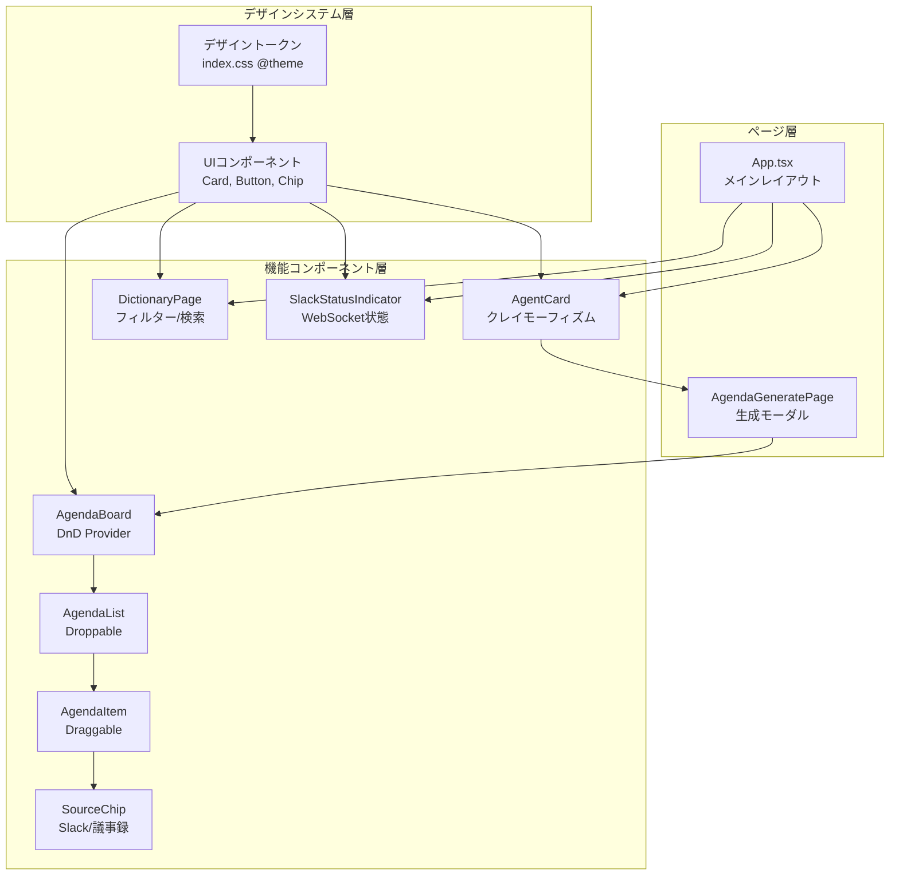
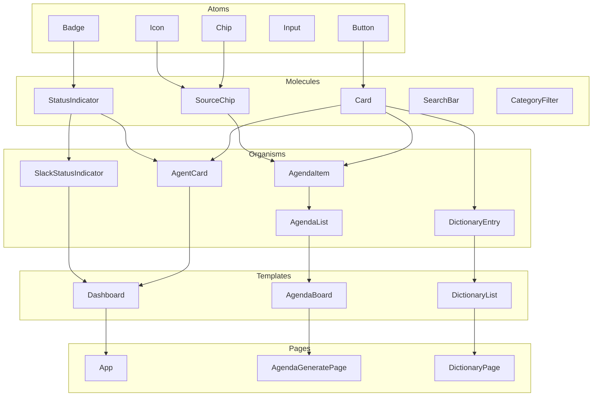
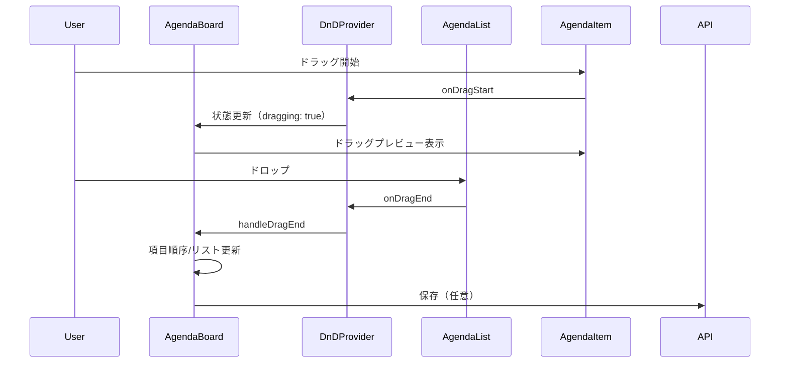

# フロントエンドUIデザイン全面刷新 設計書

## 概要

Shitaku.aiのフロントエンドUIを「ミニマル×温かみ」のnaniスタイルで全面刷新し、クレイモーフィズムデザインとドラッグ&ドロップ対応のアジェンダ編集UIを実現する。

## 設計サマリー（メタ）

```yaml
design_type: "拡張"
risk_level: "中"
main_constraints:
  - "コストゼロ運用（追加ライブラリはdnd-kitのみ）"
  - "バンドルサイズ増加+50KB以内"
  - "WCAG 2.1 AA準拠"
  - "LCP 2.5秒以内維持"
biggest_risks:
  - "クレイモーフィズムbox-shadowのパフォーマンス影響"
  - "@dnd-kit/react 0.2.xのReact 19互換性"
unknowns:
  - "複雑なbox-shadow定義がモバイルブラウザでのレンダリング時間に与える影響"
  - "WebSocket連携のリアルタイム更新実装（バックエンド側Design Doc別途必要）"
```

## 背景と経緯

### 前提となるADR

- [ADR-0002: デザインシステム基盤アーキテクチャ](../adr/frontend/ADR-0002-design-system-architecture.md): Tailwind CSS v4 @themeディレクティブによるデザイントークン定義
- [ADR-0003: DnDライブラリ選定](../adr/frontend/ADR-0003-dnd-library-selection.md): dnd-kit採用

### 合意事項チェックリスト

#### スコープ

- [x] デザインシステム基盤（カラー・タイポグラフィ・形状トークン）
- [x] MTGエージェントカードのリデザイン（クレイモーフィズム）
- [x] アジェンダ編集画面のDnD対応
- [x] ソースチップ表示機能
- [x] ユビキタス言語辞書のリスタイリング
- [x] Slack連携インジケーター

#### スコープ外（明示的に変更しないもの）

- [x] ダークモード対応
- [x] i18n（多言語対応）
- [x] WebSocket基盤（バックエンド側）の新規実装 - 本Design Docではフロントエンド表示部分のみ
- [x] 認証機能（AuthPage）のリデザイン

#### 制約

- [x] 並行運用: しない（全面刷新）
- [x] 後方互換性: 不要（新UIへ完全移行）
- [x] パフォーマンス計測: 必要（LCP、CLS、DnDレイテンシ）

### 解決すべき課題

1. 標準的なグレー・ブルー配色でビジュアルアイデンティティが欠如
2. テキストエリアベースのアジェンダ編集が直感的でない
3. アジェンダ生成後のソース情報の視認性が低い
4. MTGエージェントの「パーソナリティ」が伝わらない

### 現状の課題

- `App.tsx`: `bg-gray-800`, `text-white`, `bg-blue-500`等の標準Tailwindクラスのみ
- `AgendaEditor.tsx`: `<textarea>`ベースの編集UI、DnD未対応
- `DictionaryPage.tsx`: 基本的なリスト表示、デザイントークン未適用
- デザイントークン: 未定義（`index.css`は`@import "tailwindcss"`のみ）

### 要件

#### 機能要件

- デザインシステム基盤: カラーパレット、形状システム、タイポグラフィの定義
- MTGエージェントカード: クレイモーフィズムスタイル、アイコン/アバター表示、準備状況インジケーター
- アジェンダ編集: DnDによる並べ替え、複数リスト間移動、ソースチップ表示
- ユビキタス言語辞書: カテゴリフィルター、検索バー
- Slack連携インジケーター: 接続状態のリアルタイム表示

#### 非機能要件

- **パフォーマンス**: LCP 2.5秒以内、DnD操作レイテンシ100ms以内、バンドルサイズ増加+50KB以内
- **アクセシビリティ**: WCAG 2.1 AA準拠（コントラスト比4.5:1、キーボード操作、スクリーンリーダー対応）
- **ブラウザ対応**: Chrome/Firefox/Safari/Edge最新版、過去2バージョン
- **レスポンシブ**: デスクトップ優先、タブレット対応（768px以上）

## 受入条件（AC）- EARS形式

### デザインシステム基盤

- [ ] システムはindex.cssで@themeディレクティブを使用してデザイントークン（--color-primary-*, --color-neutral-*, --font-*, --radius-*, --shadow-clay-*）を定義する
- [ ] **When** デザイントークンが定義されると、Tailwindユーティリティクラス（bg-primary-500, text-neutral-800, rounded-clay等）が利用可能になる
- [ ] システムはWCAG 2.1 AAコントラスト比4.5:1を満たすカラー組み合わせのみを定義する

### MTGエージェントカード

- [ ] システムはMTGエージェントをクレイモーフィズムスタイル（ソフトシャドウ、大きな角丸）のカードで表示する
- [ ] 各エージェントカードはアイコン/アバター、エージェント名、準備状況インジケーターを含む
- [ ] **When** ユーザーが「アジェンダを提案して」ボタンをクリックすると、システムはローディング状態を表示しアジェンダ生成を開始する
- [ ] 準備状況インジケーターは3段階（準備完了/一部準備/未準備）を視覚的に区別して表示する

### アジェンダ編集（DnD）

- [ ] **When** ユーザーがアジェンダ項目をドラッグすると、システムはビジュアルフィードバック（影の拡大、不透明度変化）を表示する
- [ ] **When** ユーザーがアジェンダ項目を同一リスト内でドロップすると、システムは項目の順序を更新する
- [ ] **When** ユーザーがアジェンダ項目を別のリスト（「今回話す」「次回に回す」「保留」）にドロップすると、システムは項目を移動先リストに追加する
- [ ] **When** ユーザーがキーボード（Space/Enterでドラッグ開始、矢印キーで移動、Escapeでキャンセル）で操作すると、システムはドラッグ&ドロップと同等の結果を提供する
- [ ] システムは「上へ/下へ移動」ボタンをDnDの代替操作として提供する（WCAG 2.2 2.5.7対応）
- [ ] DnD操作のレイテンシは100ms以内を維持する

### ソースチップ

- [ ] 各アジェンダ項目はソースチップ（Slack/議事録）を表示する
- [ ] **If** ソースがSlackの場合、**then** システムはSlackアイコンとチャンネル名をチップに表示する
- [ ] **If** ソースが議事録の場合、**then** システムは議事録アイコンと日付をチップに表示する
- [ ] **When** ユーザーがソースチップをクリックすると、システムはソース詳細モーダルを表示する

### ユビキタス言語辞書

- [ ] システムはユビキタス言語辞書をクレイモーフィズムスタイルのカードリストで表示する
- [ ] **When** ユーザーがカテゴリフィルターを選択すると、システムは該当カテゴリのエントリのみを表示する
- [ ] **When** ユーザーが検索バーに入力すると、システムはリアルタイムでフィルタリングを適用する
  - **Property**: `filteredEntries.every(entry => entry.canonical_name.includes(query) || entry.variations.some(v => v.includes(query)))`

### Slack連携インジケーター

- [ ] システムはSlack連携状態を視覚的に表示する（接続中: 緑、切断: 赤、同期中: 黄色アニメーション）
- [ ] **When** WebSocketで新しいメッセージを受信すると、システムはインジケーターを一時的に強調表示する

## 既存コードベース分析

### 実装パスマッピング

| 種別 | パス | 説明 |
|-----|-----|-----|
| 既存 | frontend/src/index.css | Tailwind CSS import（デザイントークン追加対象） |
| 既存 | frontend/src/App.tsx | メインアプリケーション（ヘッダー、ルーティング） |
| 既存 | frontend/src/features/agendas/AgendaGeneratePage.tsx | アジェンダ生成モーダル |
| 既存 | frontend/src/features/agendas/AgendaEditor.tsx | アジェンダ編集（textarea → DnD化対象） |
| 既存 | frontend/src/features/agendas/types.ts | アジェンダ型定義（拡張対象） |
| 既存 | frontend/src/features/dictionary/DictionaryPage.tsx | 辞書一覧（リスタイリング対象） |
| 新規 | frontend/src/components/ui/Card.tsx | クレイモーフィズムカードコンポーネント |
| 新規 | frontend/src/components/ui/Button.tsx | デザインシステム準拠ボタン |
| 新規 | frontend/src/components/ui/SourceChip.tsx | ソースチップコンポーネント |
| 新規 | frontend/src/components/ui/StatusIndicator.tsx | ステータスインジケーター |
| 新規 | frontend/src/features/agendas/AgendaBoard.tsx | DnD対応アジェンダボード |
| 新規 | frontend/src/features/agendas/AgendaItem.tsx | ドラッグ可能なアジェンダ項目 |
| 新規 | frontend/src/features/agendas/AgendaList.tsx | ドロップ可能なアジェンダリスト |
| 新規 | frontend/src/features/agents/AgentCard.tsx | MTGエージェントカード |
| 新規 | frontend/src/features/slack/SlackStatusIndicator.tsx | Slack連携状態インジケーター |

### 類似コンポーネント検索結果

**検索結果**: 既存のUIコンポーネントライブラリなし。全てのスタイリングはインラインTailwindクラスで実装。

**判断**: 新規でデザインシステムコンポーネント（Card, Button, SourceChip等）を作成する。既存コンポーネントのTailwindクラスを新しいデザイントークンベースのクラスに置き換え。

### 統合ポイント（新規実装でも記載）

- **統合先**: App.tsx（エージェントカード表示）、AgendaGeneratePage.tsx（DnDエディタ統合）
- **呼び出し方式**: Reactコンポーネントとしてimport、Props経由でデータ受け渡し

## 設計

### 変更影響マップ

```yaml
変更対象: フロントエンドUI全体
直接影響:
  - frontend/src/index.css（デザイントークン追加）
  - frontend/src/App.tsx（ヘッダー、ルーティング変更）
  - frontend/src/features/agendas/AgendaEditor.tsx（DnD化）
  - frontend/src/features/agendas/AgendaGeneratePage.tsx（新Editor統合）
  - frontend/src/features/agendas/types.ts（AgendaItem型拡張）
  - frontend/src/features/dictionary/DictionaryPage.tsx（リスタイリング）
間接影響:
  - バンドルサイズ増加（dnd-kit追加）
  - レンダリング時間（box-shadow追加）
波及なし:
  - バックエンドAPI
  - 認証機能（AuthPage）
  - Supabaseクライアント設定
```

### アーキテクチャ概要



### コンポーネント階層



### データフロー



### 統合ポイント一覧

| 統合ポイント | 箇所 | 旧実装 | 新実装 | 切替方式 |
|------------|-----|-------|-------|---------|
| デザイントークン | index.css | @import "tailwindcss"のみ | @theme追加 | 上書き |
| アジェンダ編集 | AgendaEditor.tsx | textarea | AgendaBoard (DnD) | コンポーネント置換 |
| エージェント表示 | App.tsx | なし | AgentCard追加 | 追加 |
| 辞書リスト | DictionaryPage.tsx | 基本div | Card + フィルター | 置換 |
| Slack状態 | App.tsx | なし | SlackStatusIndicator | 追加 |

### 統合ポイントマップ

```yaml
統合点1:
  既存コンポーネント: AgendaGeneratePage
  統合方法: AgendaBoardコンポーネントをAgendaEditorの代わりに使用
  影響度: 高（UIフロー変更）
  必要なテスト観点: 生成→編集→保存フローの継続性

統合点2:
  既存コンポーネント: App.tsx
  統合方法: AgentCardコンポーネントを追加、ヘッダースタイル更新
  影響度: 中（レイアウト変更）
  必要なテスト観点: ナビゲーション、認証状態表示

統合点3:
  既存コンポーネント: DictionaryPage
  統合方法: CardコンポーネントとSearchBar/CategoryFilterを統合
  影響度: 中（スタイル変更）
  必要なテスト観点: CRUD操作の継続性
```

### 主要コンポーネント

#### デザイントークン（index.css）

- **責務**: カラー、タイポグラフィ、スペーシング、形状の一元定義
- **インターフェース**: CSS変数（--color-*, --font-*, --radius-*, --shadow-*）
- **依存関係**: Tailwind CSS v4

#### Card（Molecule）

- **責務**: クレイモーフィズムスタイルのコンテナ
- **インターフェース**:
  ```typescript
  interface CardProps {
    children: React.ReactNode
    variant?: 'default' | 'interactive'
    className?: string
  }
  ```
- **依存関係**: デザイントークン

#### AgendaBoard（Template）

- **責務**: DnDコンテキスト提供、複数リスト管理、ドラッグ状態管理
- **インターフェース**:
  ```typescript
  interface AgendaBoardProps {
    initialItems: AgendaItem[]
    onSave: (items: AgendaItem[]) => Promise<void>
    onCancel: () => void
  }
  ```
- **依存関係**: @dnd-kit/react, AgendaList, AgendaItem

#### AgendaItem（Organism）

- **責務**: 個別アジェンダ項目の表示、ドラッグハンドル、ソースチップ表示
- **インターフェース**:
  ```typescript
  interface AgendaItemProps {
    item: AgendaItemData
    isDragging?: boolean
  }
  ```
- **依存関係**: Card, SourceChip, useSortable

### 型定義

```typescript
// frontend/src/features/agendas/types.ts（拡張）

/** アジェンダ項目のソース情報 */
interface AgendaSource {
  type: 'slack' | 'meeting_note'
  /** Slackの場合: チャンネル名、議事録の場合: 日付 */
  label: string
  /** 詳細表示用URL（オプション） */
  url?: string
}

/** DnD対応アジェンダ項目 */
interface AgendaItemData {
  id: string
  content: string
  /** 所属リスト: discuss（今回話す）, postpone（次回に回す）, hold（保留） */
  listId: 'discuss' | 'postpone' | 'hold'
  /** リスト内での順序 */
  order: number
  sources: AgendaSource[]
}

/** アジェンダリスト定義 */
interface AgendaListData {
  id: 'discuss' | 'postpone' | 'hold'
  title: string
  items: AgendaItemData[]
}

/** エージェント準備状況 */
type AgentReadyStatus = 'ready' | 'partial' | 'not_ready'

/** MTGエージェントカードProps */
interface AgentCardProps {
  id: string
  name: string
  iconUrl?: string
  status: AgentReadyStatus
  lastAgendaDate?: string
  slackConnected: boolean
  onGenerateAgenda: (agentId: string) => void
}

/** Slack連携状態 */
type SlackConnectionStatus = 'connected' | 'disconnected' | 'syncing'
```

### データ契約

#### AgendaBoard

```yaml
入力:
  型: AgendaBoardProps
  前提条件: initialItemsは有効なAgendaItemData配列
  バリデーション: 各itemはid, content, listId, orderを持つ

出力:
  型: void（onSaveコールバック経由）
  保証: onSave時のitemsは更新された順序とlistIdを反映
  エラー時: onSaveがrejectした場合、エラー状態を表示

不変条件:
  - 各itemのidはユニーク
  - DnD操作中も既存データは失われない
```

#### SourceChip

```yaml
入力:
  型: AgendaSource
  前提条件: typeは'slack'または'meeting_note'
  バリデーション: labelは空文字列でない

出力:
  型: React.ReactNode
  保証: クリック可能なチップをレンダリング
  エラー時: urlが無効な場合、クリック時に何もしない

不変条件:
  - Slackソースはslackアイコンを表示
  - 議事録ソースはdocumentアイコンを表示
```

### 状態遷移と不変条件

#### DnD状態遷移

```
[idle] ---(onDragStart)---> [dragging]
[dragging] ---(onDragOver)---> [dragging + hover target]
[dragging] ---(onDragEnd)---> [idle + 順序更新]
[dragging] ---(onDragCancel)---> [idle]
```

**不変条件**:
- dragging状態では必ず1つのアイテムがドラッグ中
- ドロップ後は必ずidle状態に戻る
- キャンセル時は元の状態を復元

#### Slack連携状態遷移

```
[disconnected] ---(WebSocket接続成功)---> [connected]
[connected] ---(メッセージ受信)---> [syncing] ---(1秒後)---> [connected]
[connected] ---(WebSocket切断)---> [disconnected]
```

### エラーハンドリング

| エラー種別 | 発生箇所 | 処理方法 |
|-----------|---------|---------|
| DnD操作失敗 | AgendaBoard | 元の状態に復元、エラートースト表示 |
| 保存API失敗 | onSave | エラーメッセージ表示、再試行ボタン |
| WebSocket切断 | SlackStatusIndicator | 切断状態表示、自動再接続試行 |
| 無効なドロップ | onDragEnd | ドロップを無視、元の位置に戻す |

### 統合境界契約

```yaml
境界名: AgendaBoard → API
  入力(Props): AgendaBoardProps
  出力(Events): onSave(items: AgendaItemData[])
  エラー時: try-catchでエラーをキャッチ、UIにエラー状態を反映

境界名: App → AgentCard
  入力(Props): AgentCardProps
  出力(Events): onGenerateAgenda(agentId: string)
  エラー時: ボタン無効化、エラーメッセージ表示

境界名: WebSocket → SlackStatusIndicator
  入力(Props): connectionStatus: SlackConnectionStatus
  出力(Events): なし（表示のみ）
  エラー時: disconnected状態を表示

境界名: WebSocket接続管理（フロントエンド側責務）
  接続確立: WebSocket URLへの初回接続
  再接続戦略:
    - 初回リトライ: 1秒後
    - 最大リトライ回数: 5回
    - バックオフ: 指数バックオフ（1s, 2s, 4s, 8s, 16s）
    - 最大リトライ後: disconnected状態を維持、手動再接続ボタン表示
  エラーハンドリング:
    - 接続タイムアウト: 30秒
    - ハートビート間隔: 30秒（サーバー側から送信）
    - ハートビート未受信時: 接続切断と判定、再接続開始
```

## 実装計画

### 実装アプローチ

**選択したアプローチ**: ハイブリッド（基盤駆動 → 機能駆動）

**選択理由**:
1. デザインシステム基盤（Phase 1）は全コンポーネントの前提条件
2. 基盤完成後は機能単位（エージェントカード、DnDエディタ）で垂直実装
3. 各機能は独立してユーザー価値を提供可能

### 技術的依存関係と実装順序

#### 必要な実装順序

1. **デザイントークン定義（Phase 1）**
   - 技術的理由: 全UIコンポーネントのスタイリング基盤
   - 依存要素: Card, Button, 全ての新規コンポーネント

2. **UIコンポーネント（Phase 2）**
   - 技術的理由: 機能コンポーネントの構成要素
   - 前提条件: デザイントークン定義完了

3. **DnD基盤 + AgendaBoard（Phase 3）**
   - 技術的理由: dnd-kit統合、DnDコンテキスト提供
   - 前提条件: Card, Buttonコンポーネント完了

4. **機能コンポーネント（Phase 4）**
   - 技術的理由: エージェントカード、辞書リスタイリングは並行可能
   - 前提条件: UIコンポーネント完了

5. **統合・テスト（Phase 5）**
   - 技術的理由: 全体の動作確認、パフォーマンス計測
   - 前提条件: Phase 1-4完了

### 統合ポイント

**統合ポイント1: デザイントークン適用確認（Phase 1完了時）**
- コンポーネント: index.css → 既存コンポーネント
- 確認方法: 既存コンポーネントが新カラーで表示されること（L1）

**統合ポイント2: UIコンポーネント動作確認（Phase 2完了時）**
- コンポーネント: Card, Button → Storybook or テストページ
- 確認方法: クレイモーフィズムスタイルが正しく適用されること（L1）

**統合ポイント3: DnD動作確認（Phase 3完了時）**
- コンポーネント: AgendaBoard → AgendaGeneratePage
- 確認方法: ドラッグ&ドロップで項目移動が動作すること（L1）

**統合ポイント4: 全体統合（Phase 5）**
- コンポーネント: App.tsx全体
- 確認方法: E2Eでアジェンダ生成→編集→保存フローが動作すること（L1）

### 移行戦略

1. **漸進的適用**: 既存コンポーネントのTailwindクラスを順次新トークンベースに置換
2. **並行開発なし**: 旧UIは完全に新UIで置換
3. **ロールバック**: Gitブランチで旧UIへの復元を担保

## テスト戦略

### 単体テスト

- **Card, Button等UIコンポーネント**: Props変化によるスタイル変更を検証
- **AgendaItem**: ソースチップ表示、ドラッグ状態のスタイル変化
- **SourceChip**: ソースタイプに応じたアイコン・ラベル表示
- カバレッジ目標: Atoms 70%, Molecules 65%, Organisms 60%

### 統合テスト

- **AgendaBoard**: DnD操作による項目順序変更、リスト間移動
- **DictionaryPage**: フィルター・検索によるリスト絞り込み
- **App.tsx**: ルーティング、認証状態によるコンポーネント表示切替

### E2Eテスト

- アジェンダ生成→DnD編集→保存の完全フロー
- エージェントカードからの1ボタン体験
- キーボード操作によるDnD代替操作

### アクセシビリティテスト

- axe-coreによる自動テスト（カラーコントラスト、フォーカス管理）
- キーボードナビゲーション手動テスト
- スクリーンリーダー（VoiceOver）での動作確認

### パフォーマンステスト

- Lighthouse CI: LCP 2.5秒以内、CLS 0.1以下
- DnD操作のレイテンシ計測（100ms以内）
- バンドルサイズ計測（+50KB以内）

## セキュリティ考慮事項

- **XSS対策**: アジェンダコンテンツ、ソースラベルはReactのデフォルトエスケープを利用
- **クリックジャッキング**: 外部URLへのリンクは`rel="noopener noreferrer"`を付与

## 代替案

### 代替案1: Radix UI + CSS変数

- **概要**: Radix UIのプリミティブコンポーネントを使用
- **メリット**: アクセシビリティが組み込み、ヘッドレスUI
- **デメリット**: 追加依存、Tailwindとの統合に追加設定が必要
- **不採用理由**: コストゼロ運用の制約、Tailwind単体で十分実現可能

### 代替案2: 既存AgendaEditorの拡張

- **概要**: textareaをcontenteditable divに変更、ネイティブDnD使用
- **メリット**: 追加ライブラリなし
- **デメリット**: 複数リスト間移動の実装が複雑、アクセシビリティ自前実装
- **不採用理由**: 実装工数が大幅増、品質リスク

## リスクと対策

| リスク | 影響度 | 発生確率 | 対策 |
|-------|-------|---------|-----|
| dnd-kit React 19互換性問題 | 高 | 中 | 最小限の機能から段階的実装、問題発生時はネイティブDnDへフォールバック |
| box-shadowパフォーマンス劣化 | 中 | 中 | will-changeプロパティ活用、モバイルではシャドウ簡略化 |
| バンドルサイズ超過 | 中 | 低 | Tree-shaking確認、必要に応じてDynamic Import |
| WCAG準拠漏れ | 高 | 低 | axe-core自動テスト、手動チェックリスト |

## 参考資料

- [PRD: フロントエンドUIデザイン全面刷新](../prd/ui-design-refresh.md)
- [ADR-0002: デザインシステム基盤アーキテクチャ](../adr/frontend/ADR-0002-design-system-architecture.md)
- [ADR-0003: DnDライブラリ選定](../adr/frontend/ADR-0003-dnd-library-selection.md)

## References

- [Tailwind CSS v4 Theme Variables](https://tailwindcss.com/docs/theme) - デザイントークン定義
- [dnd-kit Official Documentation](https://docs.dndkit.com) - DnD実装リファレンス
- [dnd-kit Accessibility Guide](https://docs.dndkit.com/guides/accessibility) - アクセシビリティ実装
- [WCAG 2.1 Quick Reference](https://www.w3.org/WAI/WCAG21/quickref/) - アクセシビリティ基準
- [WCAG 2.2 Dragging Movements](https://www.w3.org/WAI/WCAG22/Understanding/dragging-movements.html) - DnD代替操作要件
- [Claymorphism CSS Generator](https://hype4.academy/tools/claymorphism-generator) - クレイモーフィズムスタイル生成
- [Implementing Claymorphism with CSS](https://blog.logrocket.com/implementing-claymorphism-css/) - クレイモーフィズム実装ガイド

## 更新履歴

| 日付 | バージョン | 変更内容 | 作成者 |
|-----|-----------|---------|-------|
| 2026-02-01 | 1.0 | 初版作成 | AI Assistant |
