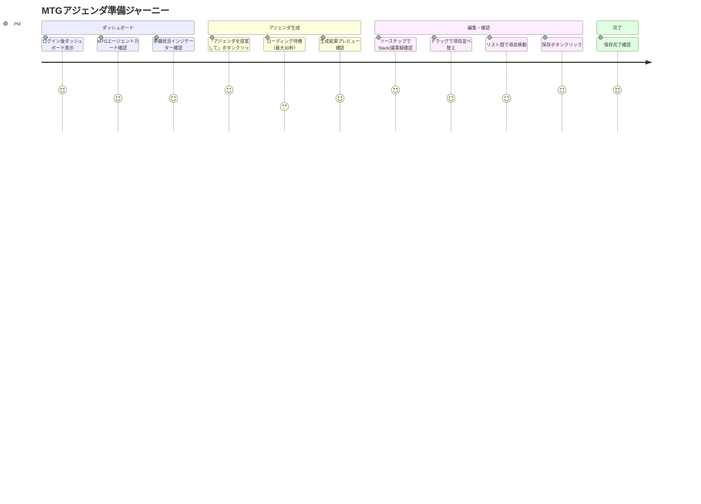
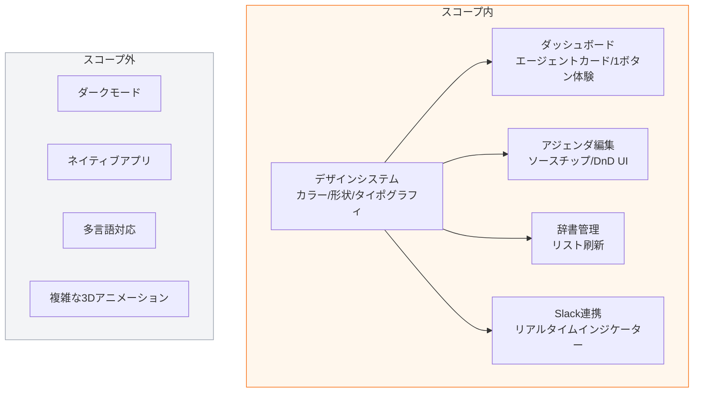

# PRD: フロントエンドUIデザイン全面刷新

## 概要

### 一言まとめ
Shitaku.aiのフロントエンドUIを「ミニマル×温かみ」のnaniスタイルで全面刷新し、エージェント中心の1ボタン体験を実現する。

### 背景
現在のShitaku.aiフロントエンドは基本的なTailwind CSSスタイルで実装されており、以下の課題がある：

- **ビジュアルアイデンティティの欠如**: 標準的なグレー・ブルー系のカラーで差別化されていない
- **MTGエージェントの存在感不足**: リスト形式のカード表示でエージェントの「パーソナリティ」が伝わらない
- **情報ソースの透明性欠如**: アジェンダ生成後のソース情報がテキストのみで視認性が低い
- **操作の複雑さ**: アジェンダ編集がテキストエリアベースで直感的でない

本PRDでは、PMやEMが「このツールを使いたい」と感じる魅力的なUIを実現し、定例MTG準備の心理的ハードルを下げることを目指す。

## ユーザーストーリー

### 主要ユーザー
- **PM/EM**: 3〜10本の定例MTGを抱え、毎週のアジェンダ準備に時間を取られている
- **MVP検証対象**: 5〜10人の初期ユーザー

### ユーザーストーリー

```
PMとして
MTG準備を「作業」ではなく「ワンクリック体験」にしたい
なぜなら準備の煩雑さがMTGの質を下げているから
```

```
EMとして
AIエージェントとの対話感覚でアジェンダを確認したい
なぜなら機械的なツールより親しみやすいUIの方が継続利用しやすいから
```

### ユースケース
1. **ダッシュボードからの1ボタン体験**: ユーザーはMTGエージェントカードを見て「次回のアジェンダを提案して」ボタンを押すだけでアジェンダが生成される
2. **ソース確認**: 生成されたアジェンダの各項目に表示されるソースチップ（Slack/議事録）をクリックして根拠を確認
3. **ドラッグ&ドロップ編集**: アジェンダ項目をキャンバス上でドラッグし、優先順位を変更したり、複数リスト間で項目を移動

## 機能要件

### Must Have（MVP）

#### デザインシステム基盤
- [ ] **カラーパレット定義**: シャーベットオレンジ/アプリコットを主役とした配色システム
  - AC: プライマリ（オレンジ系）、ニュートラル（ホワイト、ダークグレー）、アクセントの3層で定義
  - AC: WCAG 2.1 AAコントラスト比を満たす組み合わせのみ使用
- [ ] **形状システム定義**: 大きな角丸（スクアクル）、ソフトドロップシャドウ
  - AC: ボタン・カード・モーダルに統一的な角丸半径を適用
  - AC: クレイモーフィズムスタイル（ソフトな影、ふくらんだ質感）のコンポーネント規定
- [ ] **タイポグラフィ定義**: 角に丸みのあるサンセリフ体
  - AC: 日本語・英語で読みやすいフォントファミリーを選定
  - AC: 見出し・本文・キャプションのサイズ階層を定義

#### ダッシュボード画面
- [ ] **MTGエージェントカード**: エージェントにシンプルなアイコン/アバターを表示
  - AC: 各エージェントが視覚的に識別可能なアイコンを持つ
  - AC: カード全体がクレイモーフィズムスタイル（ソフトシャドウ、角丸）
- [ ] **準備状況インジケーター**: 各エージェントの準備状況（最新アジェンダ有無、Slack連携状態）を視覚化
  - AC: ステータスが3段階（準備完了/一部準備/未準備）で識別可能
- [ ] **1ボタン体験**: 「次回のアジェンダを提案して」ボタンをカード中央に目立つ形で配置
  - AC: ボタンが視覚的に最も目立つ要素として配置
  - AC: クリック後、ローディング状態が明確に表示される

#### アジェンダ編集画面
- [ ] **ソースチップ表示**: アジェンダ項目にSlack/議事録のソースリンクをチップ形式で添付
  - AC: チップをクリックすると元のコンテキストにジャンプ（または詳細モーダル表示）
  - AC: ソース種別（Slack/議事録）が視覚的に区別可能
- [ ] **ドラッグ&ドロップUI**: アジェンダ項目をドラッグで並べ替え、複数リスト間で移動可能
  - AC: 1つのリスト内での並べ替えが可能
  - AC: 複数リスト間（例: 「今回話す」「次回に回す」「保留」）での移動が可能
  - AC: ドラッグ中のビジュアルフィードバック（影、ハイライト）

#### Slack連携インジケーター
- [ ] **リアルタイム更新表示**: WebSocketを使用したSlack連携状態のリアルタイム表示
  - AC: 接続中/切断/同期中の3状態が視覚的に識別可能
  - AC: 新しいメッセージ受信時にインジケーターが一時的に強調

#### ユビキタス言語辞書
- [ ] **シンプルなリストUI**: 現在のリスト形式を刷新されたデザインシステムで再スタイリング
  - AC: カテゴリ別のフィルタリング機能
  - AC: 検索バーによる絞り込み

### Should Have

- [ ] **エージェントアバターカスタマイズ**: ユーザーがエージェントのアイコンを選択可能
- [ ] **アニメーション効果**: マイクロインタラクション（ホバー、クリック、遷移）
- [ ] **キーボードショートカット**: パワーユーザー向けのショートカット操作

### Could Have

- [ ] **テーマカスタマイズ**: オレンジ以外のカラーテーマオプション
- [ ] **ウィジェット配置カスタマイズ**: ダッシュボードのレイアウト変更

### スコープ外
- **ダークモード**: 本リリースではライトモードのみ。ダークモードは将来対応
- **ネイティブアプリ対応**: Web UIに集中し、モバイルアプリは対象外
- **複雑なアニメーション**: パフォーマンスに影響する過度な3Dアニメーションは含まない
- **マルチ言語対応**: 日本語UIのみ、i18nは将来対応

## 非機能要件

### パフォーマンス
- **初回ロード時間**: LCP（Largest Contentful Paint）2.5秒以内
- **インタラクション応答**: ドラッグ&ドロップ操作のレイテンシ100ms以内
- **バンドルサイズ増加**: 現状比+50KB以内（DnDライブラリ含む）

### 信頼性
- **ブラウザ対応**: Chrome/Firefox/Safari/Edge最新版、過去2バージョン
- **レスポンシブ対応**: デスクトップ優先、タブレット対応（768px以上）

### セキュリティ
- **XSS対策**: ユーザー入力のサニタイゼーション（Reactデフォルト動作を維持）
- **CSRF対策**: 既存のSupabase認証機構を継続使用

### アクセシビリティ
- **WCAG 2.1 AA準拠**: カラーコントラスト、キーボード操作、スクリーンリーダー対応
- **フォーカス管理**: モーダル・ドロップダウンのフォーカストラップ
- **代替テキスト**: アイコン・画像への適切なaria-label付与

### スケーラビリティ
- **コンポーネント設計**: 再利用可能なデザインシステムコンポーネント
- **将来の拡張性**: 新画面追加時にデザイン一貫性を維持できる構造

## 成功基準

### 定量的指標
1. **タスク完了時間**: アジェンダ編集完了までの時間が現状比30%短縮
   - ベースライン測定: MVP検証開始時に既存UIで5人のユーザーのタスク完了時間を計測
   - 測定タスク: 「アジェンダ生成→2項目の並べ替え→保存」の一連の操作
   - 改善後測定: 同一ユーザーで新UIでの同一タスクを計測し比較
2. **操作ステップ数**: アジェンダ生成から保存までのクリック数が5回以内
3. **パフォーマンス**: LCP 2.5秒以内、CLS 0.1以下を維持

### 定性的指標
1. **ユーザー満足度**: MVP検証ユーザー5人中4人以上が「使いやすい」と評価
2. **視覚的魅力**: 「温かみがある」「親しみやすい」というフィードバック獲得
3. **継続利用意向**: 「毎週使いたい」という意向表明

## 技術的考慮事項

### 依存関係
- **Tailwind CSS v4**: 既存のスタイリング基盤を活用
- **React 19**: 既存のコンポーネント構造を維持
- **dnd-kit または react-beautiful-dnd**: ドラッグ&ドロップ機能（要技術選定）
- **WebSocket**: Slack連携リアルタイム更新（バックエンド側変更も必要）

### 制約
- **コストゼロ運用**: 無料枠内でのホスティング継続（Vercel Hobby）
- **既存機能との互換性**: 現在動作している機能を破壊しない段階的移行
- **バンドルサイズ**: 追加ライブラリによる肥大化を最小限に

### 前提条件
- **Tailwind CSS v4のカスタマイズ**: CSS変数ベースのデザイントークン定義が可能
- **WebSocketインフラ**: リアルタイム更新のためのバックエンド対応（別途Design Doc必要）

### リスクと対策
| リスク | 影響度 | 発生確率 | 対策 |
|-------|-------|---------|-----|
| DnDライブラリのバンドルサイズ肥大化 | 中 | 中 | Tree-shakingの徹底、軽量ライブラリ（dnd-kit）の採用検討 |
| アクセシビリティ要件未達 | 高 | 低 | 開発初期からaxe-coreでの自動テスト導入 |
| デザインの実装ギャップ | 中 | 中 | デザイントークンの厳密定義、Storybookでのプレビュー |
| WebSocket接続の不安定性 | 中 | 中 | フォールバック（ポーリング）の実装、接続状態の可視化 |

## ユーザージャーニー図



## スコープ境界図



## 未決定事項

本PRDは完成版として作成されました。ユーザーから提供された情報に基づき、以下の事項は確定済みです：

- **テーマ**: ライトモードのみ（確定）
- **DnD範囲**: 複数リスト間移動対応（確定）
- **Slack連携**: リアルタイム更新/WebSocket使用（確定）
- **アクセシビリティ**: WCAG 2.1 AA準拠（確定）

## 付録

### 参考資料
- [Claymorphism in User Interfaces](https://hype4.academy/articles/design/claymorphism-in-user-interfaces)
- [UX/UI Design Trends 2025](https://www.thebract.com/post/ux-ui-design-trends-2025)
- [12 UI/UX Design Trends That Will Dominate 2026](https://www.index.dev/blog/ui-ux-design-trends)
- [Claymorphism Tutorial](https://uxmisfit.com/2022/04/29/claymorphism-tutorial-how-to-mimic-clay-in-ui-design/)
- [WCAG 2.1 Guidelines](https://www.w3.org/WAI/WCAG21/quickref/)

### 用語集
- **naniスタイル**: ミニマルと温かみを両立したUIデザインスタイル
- **スクアクル（Squircle）**: 正方形と円の中間的な形状。通常の角丸より自然で柔らかい印象
- **クレイモーフィズム**: 粘土のような質感を持つUIデザイン手法。ソフトな影と丸みを特徴とする
- **1ボタン体験**: 最小限の操作（1クリック）で主要タスクを完了できるUX設計
- **ソースチップ**: 情報の出典を小さなラベル形式で表示するUI要素
- **デザイントークン**: カラー・サイズ・間隔などを変数化したデザインシステムの基礎単位
