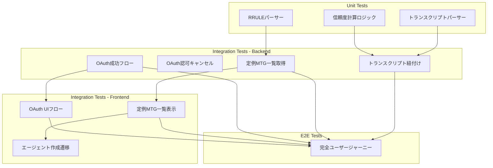

# Google Workspace連携機能 テストスケルトン

Design Doc: `docs/design/google-workspace-integration-design.md`
生成日時: 2026-02-01 | 枠使用: 3/3統合, 1/2 E2E

---

## テスト対象のAC一覧

### 対象AC（統合/E2Eテスト）

| AC# | キーワード | AC文 | 判定 |
|-----|-----------|------|------|
| AC1 | When | 「Googleで連携」クリック→OAuth画面リダイレクト | INCLUDE |
| AC2 | When | スコープ許可→トークン保存→成功画面 | INCLUDE |
| AC3 | If-then | 認可キャンセル→エラー画面 | (統合テストで結合) |
| AC4 | When | 既存連携時→トークン更新 | (統合テストで結合) |
| AC5 | When | 一覧画面→Calendar API→定例MTG表示 | INCLUDE |
| AC9 | When | 定例MTG選択→エージェント作成画面遷移 | (E2Eでカバー) |
| AC10 | When | 追加スコープ未許可→Incremental Auth表示 | (E2Eでカバー) |
| AC11 | When | スコープ許可済み→トランスクリプト検索 | (E2Eでカバー) |
| AC12 | 無印 | Docsからテキスト取得・構造化 | (E2Eでカバー) |
| AC16 | If-then | 信頼度>=0.7→自動紐付け | INCLUDE |
| AC17 | If-then | 信頼度<0.7→手動確認リクエスト | (統合テストで結合) |

### 除外AC（ユニットテストで検証）

| AC# | AC文 | 除外理由 |
|-----|------|---------|
| AC6 | RRULEイベントのみ検出 | [UNIT_LEVEL] - RRULE解析ロジックの単体テスト |
| AC7 | 参加者2人以上のみ | [UNIT_LEVEL] - フィルタリング条件の単体テスト |
| AC8 | 過去3ヶ月実績あり | [UNIT_LEVEL] - 日付フィルタリングの単体テスト |
| AC13 | ドキュメント名と会議名マッチング | [UNIT_LEVEL] - 文字列類似度計算の単体テスト |
| AC14 | 日時比較（±24時間） | [UNIT_LEVEL] - 時間差計算の単体テスト |
| AC15 | 参加者名と話者名照合 | [UNIT_LEVEL] - Jaccard係数計算の単体テスト |

---

## 統合テストスケルトン（API層）

### バックエンド統合テスト（pytest）

```python
# backend/tests/integration/test_google_integration.py
# Google Workspace Integration Test - Design Doc: google-workspace-integration-design.md
# 生成日時: 2026-02-01 | 枠使用: 3/3統合, 0/2 E2E

"""
Google Workspace連携機能のバックエンド統合テスト

テスト対象:
- Google OAuth認証フロー
- Calendar API連携（定例MTG検出）
- 紐付けロジック（信頼度計算・自動/手動判定）
"""

import pytest
from unittest.mock import AsyncMock, MagicMock, patch
from uuid import uuid4
from datetime import datetime, timezone
from httpx import AsyncClient


class TestGoogleOAuthIntegration:
    """Google OAuth認証の統合テスト"""

    # AC: "When ユーザーが「Googleで連携」ボタンをクリックすると、
    #      システムはGoogle OAuth認可画面にリダイレクトする"
    # + "When ユーザーがGoogleでスコープを許可すると、
    #      システムはRefresh Tokenを暗号化して保存し、
    #      フロントエンドの成功画面にリダイレクトする"
    # ROI: 107 | ビジネス価値: 10 | 頻度: 10
    # 振る舞い: 認証URL取得 → state生成 → コールバック → トークン暗号化保存 → 成功リダイレクト
    # @category: core-functionality
    # @dependency: GoogleOAuthClient, EncryptionModule, GoogleIntegrationRepository
    # @complexity: high
    #
    # 検証項目:
    # - /api/v1/google/auth がauthorize_urlを返す
    # - state パラメータがセッションに保存される
    # - コールバックでトークンが暗号化されてDBに保存される
    # - 成功時にフロントエンドURLにリダイレクトされる
    # - 既存連携がある場合はトークンが更新される（新規作成ではない）
    @pytest.mark.asyncio
    async def test_oauth_success_flow_creates_integration_with_encrypted_token(
        self,
        client: AsyncClient,
        mock_google_oauth_client: MagicMock,
        authenticated_user: dict,
    ) -> None:
        """AC1,2,4: OAuth成功フローでトークンが暗号化保存される"""
        # TODO: 実装
        # Arrange:
        #   - mock_google_oauth_client.exchange_code_for_token() をモック
        #   - 認証済みユーザーでリクエスト
        # Act:
        #   1. GET /api/v1/google/auth でauthorize_url取得
        #   2. GET /api/v1/google/callback?code=xxx&state=xxx でコールバック
        # Assert:
        #   - authorize_urlがGoogle OAuth URLを含む
        #   - google_integrationsテーブルにレコードが作成される
        #   - encrypted_refresh_tokenが暗号化されている
        #   - 既存レコードがある場合は更新される
        pytest.skip("未実装: OAuth成功フローの統合テスト")

    # AC: "If ユーザーが認可をキャンセルした場合、
    #      then システムはエラー画面にリダイレクトする"
    # ROI: 23 | ビジネス価値: 8 | 頻度: 2
    # 振る舞い: 認可キャンセル → エラーコード受信 → エラー画面リダイレクト
    # @category: edge-case
    # @dependency: GoogleOAuthClient
    # @complexity: low
    #
    # 検証項目:
    # - error=access_deniedパラメータでコールバックされた場合
    # - エラー画面URLにリダイレクトされる
    # - DBに不完全なレコードが作成されない
    @pytest.mark.asyncio
    async def test_oauth_cancel_redirects_to_error_page(
        self,
        client: AsyncClient,
        authenticated_user: dict,
    ) -> None:
        """AC3: 認可キャンセルでエラー画面にリダイレクトされる"""
        # TODO: 実装
        # Arrange:
        #   - stateを事前に生成・保存
        # Act:
        #   - GET /api/v1/google/callback?error=access_denied&state=xxx
        # Assert:
        #   - エラー画面URLへのリダイレクトレスポンス
        #   - google_integrationsにレコードが作成されていない
        pytest.skip("未実装: OAuth認可キャンセルの統合テスト")


class TestCalendarAPIIntegration:
    """Calendar API連携の統合テスト"""

    # AC: "When Google連携済みユーザーが定例MTG一覧画面を開くと、
    #      システムはCalendar APIから繰り返し予定を取得して表示する"
    # ROI: 84 | ビジネス価値: 9 | 頻度: 9
    # 振る舞い: 一覧画面アクセス → トークン復号 → Calendar API呼び出し → RRULE解析 → フィルタリング → 一覧表示
    # @category: core-functionality
    # @dependency: GoogleCalendarClient, RecurringMeetingRepository, Encryption
    # @complexity: high
    #
    # 検証項目:
    # - /api/v1/google/calendar/recurring がrecurring_meetingsを返す
    # - RRULEを持つイベントのみが返される
    # - 参加者2人以上のイベントのみが返される
    # - 過去3ヶ月以内に実績があるイベントのみが返される
    # - next_occurrenceが正しく計算されている
    @pytest.mark.asyncio
    async def test_calendar_recurring_meetings_list_with_filtering(
        self,
        client: AsyncClient,
        mock_google_calendar_client: MagicMock,
        authenticated_user_with_google: dict,
    ) -> None:
        """AC5: Calendar APIから定例MTG一覧を取得できる"""
        # TODO: 実装
        # Arrange:
        #   - mock_google_calendar_client.list_events() に以下を返すようモック:
        #     - RRULE付きイベント（対象）
        #     - RRULEなし単発イベント（除外）
        #     - 参加者1人のイベント（除外）
        #     - 4ヶ月前が最終実績のイベント（除外）
        # Act:
        #   - GET /api/v1/google/calendar/recurring
        # Assert:
        #   - 対象イベントのみがレスポンスに含まれる
        #   - frequency, next_occurrence, attendeesが正しく設定されている
        pytest.skip("未実装: 定例MTG一覧取得の統合テスト")


class TestTranscriptMatchingIntegration:
    """トランスクリプト紐付けロジックの統合テスト"""

    # AC: "If 信頼度スコアが閾値（0.7）以上の場合、
    #      then システムは自動紐付けを行う"
    # + "If 信頼度スコアが閾値未満の場合、
    #      then システムは手動確認をリクエストする"
    # ROI: 66 | ビジネス価値: 9 | 頻度: 7
    # 振る舞い: トランスクリプト取得 → 信頼度計算 → 閾値判定 → 自動紐付けor手動確認フラグ
    # @category: core-functionality
    # @dependency: TranscriptUseCases, MeetingTranscriptRepository, GoogleDocsClient
    # @complexity: high
    #
    # 検証項目:
    # - 信頼度 >= 0.7 の場合、meeting_transcripts.match_confidence >= 0.7
    # - 信頼度 >= 0.7 の場合、recurring_meeting_idが自動設定される
    # - 信頼度 < 0.7 の場合、手動確認フラグが設定される
    # - 信頼度計算が正しく実行される（会議名類似度0.4 + 日時0.3 + 参加者0.3）
    @pytest.mark.asyncio
    async def test_transcript_auto_linking_above_threshold(
        self,
        client: AsyncClient,
        mock_google_drive_client: MagicMock,
        mock_google_docs_client: MagicMock,
        authenticated_user_with_google: dict,
        existing_recurring_meeting: dict,
    ) -> None:
        """AC16,17: 信頼度に応じた自動/手動紐付け判定"""
        # TODO: 実装
        # Arrange:
        #   - 定例MTG "週次定例" を作成（参加者: user1@example.com, user2@example.com）
        #   - mock_google_drive_client で以下のドキュメントを返すようモック:
        #     - "週次定例 - 2026-01-31" (高信頼度: 名前一致、日時近い、参加者一致)
        #     - "不明な会議" (低信頼度: 名前不一致、参加者不明)
        #   - mock_google_docs_client でトランスクリプト内容を返す
        # Act:
        #   - POST /api/v1/google/transcripts/sync
        # Assert:
        #   - 高信頼度ドキュメント: match_confidence >= 0.7, recurring_meeting_id = 定例MTGのID
        #   - 低信頼度ドキュメント: match_confidence < 0.7, 手動確認フラグ = true
        pytest.skip("未実装: トランスクリプト紐付けの統合テスト")


# フィクスチャ定義（conftest.pyに配置）
@pytest.fixture
def mock_google_oauth_client() -> MagicMock:
    """Google OAuthクライアントのモック"""
    # TODO: 実装
    # - exchange_code_for_token() → (access_token, refresh_token) を返す
    # - get_authorize_url() → authorize_url を返す
    pass


@pytest.fixture
def mock_google_calendar_client() -> MagicMock:
    """Google Calendarクライアントのモック"""
    # TODO: 実装
    # - list_events() → CalendarEvent[] を返す
    pass


@pytest.fixture
def mock_google_drive_client() -> MagicMock:
    """Google Driveクライアントのモック"""
    # TODO: 実装
    # - list_files(folder_name="Meet Recordings") → DriveFile[] を返す
    pass


@pytest.fixture
def mock_google_docs_client() -> MagicMock:
    """Google Docsクライアントのモック"""
    # TODO: 実装
    # - get_document_content(doc_id) → raw_text を返す
    pass


@pytest.fixture
def authenticated_user_with_google() -> dict:
    """Google連携済みの認証ユーザー"""
    # TODO: 実装
    # - google_integrations レコードを持つユーザー
    pass


@pytest.fixture
def existing_recurring_meeting() -> dict:
    """既存の定例MTGフィクスチャ"""
    # TODO: 実装
    # - recurring_meetings レコード
    pass
```

### フロントエンド統合テスト（Vitest）

```typescript
// frontend/src/features/google/google.int.test.tsx
// Google Workspace Integration Test - Design Doc: google-workspace-integration-design.md
// 生成日時: 2026-02-01 | 枠使用: 3/3統合, 1/2 E2E

/**
 * Google Workspace連携機能のフロントエンド統合テスト
 *
 * テスト対象:
 * - Google OAuth認証UI
 * - 定例MTG一覧表示
 * - トランスクリプト表示
 */

import { QueryClient, QueryClientProvider } from '@tanstack/react-query'
import { render, screen, waitFor } from '@testing-library/react'
import userEvent from '@testing-library/user-event'
import { HttpResponse, http } from 'msw'
import { setupServer } from 'msw/node'
import { afterAll, afterEach, beforeAll, beforeEach, describe, expect, it, vi } from 'vitest'
// import { GoogleIntegrationPage } from './GoogleIntegrationPage'
// import { RecurringMeetingList } from './RecurringMeetingList'

// Mock supabase
vi.mock('../../lib/supabase', () => ({
  supabase: {
    auth: {
      getSession: vi.fn().mockResolvedValue({
        data: { session: { access_token: 'test-token' } },
      }),
      onAuthStateChange: vi.fn().mockReturnValue({
        data: { subscription: { unsubscribe: vi.fn() } },
      }),
      signOut: vi.fn(),
    },
  },
}))

const API_BASE_URL = import.meta.env.VITE_API_URL || 'http://localhost:8000'

// モックデータ
const mockGoogleIntegrations = [
  {
    id: 'integration-1',
    email: 'user@example.com',
    granted_scopes: ['calendar.readonly'],
    created_at: '2026-02-01T10:00:00Z',
    updated_at: null,
  },
]

const mockRecurringMeetings = [
  {
    id: 'meeting-1',
    google_event_id: 'event-123',
    title: '週次定例',
    rrule: 'RRULE:FREQ=WEEKLY;BYDAY=MO',
    frequency: 'weekly',
    attendees: [
      { email: 'user1@example.com', name: 'User 1' },
      { email: 'user2@example.com', name: 'User 2' },
    ],
    next_occurrence: '2026-02-03T10:00:00Z',
    agent_id: null,
    created_at: '2026-02-01T10:00:00Z',
    updated_at: null,
  },
]

const server = setupServer(
  http.get(`${API_BASE_URL}/api/v1/google/integrations`, () => {
    return HttpResponse.json(mockGoogleIntegrations)
  }),
  http.get(`${API_BASE_URL}/api/v1/google/auth`, () => {
    return HttpResponse.json({
      authorize_url: 'https://accounts.google.com/o/oauth2/v2/auth?state=test-state',
    })
  }),
  http.get(`${API_BASE_URL}/api/v1/google/calendar/recurring`, () => {
    return HttpResponse.json(mockRecurringMeetings)
  }),
)

beforeAll(() => server.listen())
afterEach(() => server.resetHandlers())
afterAll(() => server.close())

function createTestQueryClient() {
  return new QueryClient({
    defaultOptions: {
      queries: {
        retry: false,
      },
    },
  })
}

function renderWithProviders(ui: React.ReactElement) {
  const queryClient = createTestQueryClient()
  return render(<QueryClientProvider client={queryClient}>{ui}</QueryClientProvider>)
}

describe('Google Workspace Integration Test', () => {
  beforeEach(() => {
    vi.clearAllMocks()
  })

  // AC: "When ユーザーが「Googleで連携」ボタンをクリックすると、
  //      システムはGoogle OAuth認可画面にリダイレクトする"
  // ROI: 107 | ビジネス価値: 10 | 頻度: 10
  // 振る舞い: 連携ボタンクリック → API呼び出し → Google OAuth URLへリダイレクト
  // @category: core-functionality
  // @dependency: GoogleConnectButton, useGoogleAuth hook, API Client
  // @complexity: low
  //
  // 検証項目:
  // - 連携ボタンクリックでAPI呼び出しが実行される
  // - Google OAuth URLへのリダイレクトが発生する
  // - リダイレクト前にローディング状態が表示される
  it.todo('AC1: Google連携ボタンでOAuth画面にリダイレクトされる')
  // 実装時:
  // const user = userEvent.setup()
  // const mockLocation = { ...window.location, href: '' }
  // Object.defineProperty(window, 'location', { value: mockLocation, writable: true })
  // renderWithProviders(<GoogleIntegrationPage />)
  // await user.click(screen.getByRole('button', { name: /Googleで連携/i }))
  // await waitFor(() => {
  //   expect(mockLocation.href).toContain('accounts.google.com')
  // })

  // AC: "When Google連携済みユーザーが定例MTG一覧画面を開くと、
  //      システムはCalendar APIから繰り返し予定を取得して表示する"
  // ROI: 84 | ビジネス価値: 9 | 頻度: 9
  // 振る舞い: 一覧画面アクセス → API呼び出し → 定例MTG一覧表示
  // @category: core-functionality
  // @dependency: RecurringMeetingList, useRecurringMeetings hook, API Client
  // @complexity: medium
  //
  // 検証項目:
  // - 画面表示時にAPI呼び出しが実行される
  // - 定例MTGのタイトル、頻度、次回開催日が表示される
  // - 参加者一覧が表示される
  // - 未連携時は「Google連携してください」メッセージ表示
  it.todo('AC5: 定例MTG一覧画面でCalendar連携イベントが表示される')
  // 実装時:
  // renderWithProviders(<RecurringMeetingList />)
  // await waitFor(() => {
  //   expect(screen.getByText('週次定例')).toBeInTheDocument()
  //   expect(screen.getByText(/毎週/)).toBeInTheDocument()
  //   expect(screen.getByText('User 1')).toBeInTheDocument()
  // })

  // AC: "When 定例MTGを選択すると、
  //      システムはエージェント作成画面に遷移し、会議名・参加者をプリセットする"
  // ROI: 50 | ビジネス価値: 8 | 頻度: 6
  // 振る舞い: 定例MTG選択 → エージェント作成画面遷移 → フォームプリセット
  // @category: core-functionality
  // @dependency: RecurringMeetingList, AgentCreatePage, Router
  // @complexity: medium
  //
  // 検証項目:
  // - 定例MTGクリックでエージェント作成画面に遷移する
  // - 会議名がエージェント名フィールドにプリセットされる
  // - 参加者がメンバーフィールドにプリセットされる
  it.todo('AC9: 定例MTG選択でエージェント作成画面に遷移しプリセットされる')
  // 実装時:
  // const user = userEvent.setup()
  // const mockNavigate = vi.fn()
  // vi.mock('react-router-dom', () => ({ useNavigate: () => mockNavigate }))
  // renderWithProviders(<RecurringMeetingList />)
  // await user.click(screen.getByText('週次定例'))
  // expect(mockNavigate).toHaveBeenCalledWith('/agents/new', {
  //   state: { meetingTitle: '週次定例', attendees: [...] }
  // })
})
```

---

## E2Eテストスケルトン（ユーザーフロー）

### フロントエンドE2Eテスト（Playwright推奨）

```typescript
// e2e/google-workspace.e2e.test.ts
// Google Workspace E2E Test - Design Doc: google-workspace-integration-design.md
// 生成日時: 2026-02-01 | 枠使用: 1/2 E2E
// テスト種別: End-to-End Test
// 実装タイミング: 全機能実装完了後

/**
 * Google Workspace連携機能のE2Eテスト
 *
 * ユーザージャーニー:
 * Google連携 → 定例MTG検出 → トランスクリプト取得 → 自動紐付け完了
 */

import { test, expect } from '@playwright/test'

test.describe('Google Workspace E2E Test', () => {
  // ユーザージャーニー: 完全なGoogle連携フロー
  // （認証 → 定例MTG検出 → トランスクリプト取得 → 紐付け完了）
  // ROI: 29 | ビジネス価値: 10 | 頻度: 10 | 法的: false
  // 振る舞い: Google連携 → Calendar同期 → Drive/Docs同期 → 紐付け → 確認表示
  // @category: e2e
  // @dependency: full-system
  // @complexity: high
  //
  // 前提条件:
  // - テストユーザーがGoogle Workspaceアカウントを持っている
  // - Meet Recordingsフォルダにトランスクリプトが存在する
  // - 定例MTG（RRULE付き）がCalendarに登録されている
  //
  // 検証項目:
  // - Google連携ボタンから認証が完了する
  // - 認証後、連携済みメールアドレスが表示される
  // - 定例MTG一覧に検出された会議が表示される
  // - トランスクリプトが取得され、定例MTGに紐付けられる
  // - 紐付け結果（自動/手動確認）が正しく表示される
  test.skip('ユーザージャーニー: Google連携から紐付け完了まで', async ({ page }) => {
    // TODO: 実装
    // Step 1: ログイン状態でGoogle連携ページにアクセス
    // await page.goto('/settings/google')
    // await expect(page.getByRole('button', { name: /Googleで連携/ })).toBeVisible()

    // Step 2: Google OAuth認証（テスト環境ではモック or 実際のOAuth）
    // Note: 実際のOAuthテストは複雑なため、以下いずれかを選択:
    //   a) Googleテストアカウントを使用した実環境テスト
    //   b) OAuthコールバックをモックしたテスト
    // await page.click('button:has-text("Googleで連携")')
    // await page.waitForURL(/accounts\.google\.com/)  // OAuth画面
    // // ... OAuth認証処理 ...
    // await page.waitForURL('/settings/google?success=true')

    // Step 3: 連携成功後の表示確認
    // await expect(page.getByText('user@example.com')).toBeVisible()
    // await expect(page.getByText('連携済み')).toBeVisible()

    // Step 4: 定例MTG一覧の確認
    // await page.goto('/google/recurring-meetings')
    // await expect(page.getByText('週次定例')).toBeVisible()
    // await expect(page.getByText(/毎週/)).toBeVisible()

    // Step 5: トランスクリプト同期と紐付け確認
    // await page.click('button:has-text("トランスクリプトを同期")')
    // await page.waitForResponse('**/api/v1/google/transcripts/sync')
    // await expect(page.getByText('自動紐付け完了')).toBeVisible()  // 高信頼度
    // // または
    // await expect(page.getByText('手動確認が必要')).toBeVisible()  // 低信頼度
  })

  // 追加E2Eテスト（枠: 2/2）- 必要に応じて実装
  // ユーザージャーニー: 定例MTGからエージェント作成まで
  // ROI: 25 | ビジネス価値: 10 | 頻度: 8
  test.skip('ユーザージャーニー: 定例MTG選択からエージェント作成完了まで', async ({ page }) => {
    // TODO: 実装
    // Step 1: Google連携済み状態で定例MTG一覧にアクセス
    // Step 2: 定例MTGを選択
    // Step 3: エージェント作成画面でプリセット確認
    // Step 4: エージェント作成完了
    // Step 5: 作成されたエージェントに定例MTGが紐付いていることを確認
  })
})
```

---

## モック境界の定義

### バックエンド モック境界

| コンポーネント | モック | 実物 | 判断理由 |
|---------------|--------|------|----------|
| Google OAuth API | モック必須 | - | 外部ネットワーク通信 |
| Google Calendar API | モック必須 | - | 外部ネットワーク通信 |
| Google Drive API | モック必須 | - | 外部ネットワーク通信 |
| Google Docs API | モック必須 | - | 外部ネットワーク通信 |
| Supabase DB | - | 実物推奨 | テスト対象のデータ永続化 |
| Encryption Module | - | 実物必須 | テスト対象の暗号化処理 |
| GoogleAuthUseCases | - | 実物必須 | テスト対象のビジネスロジック |
| CalendarUseCases | - | 実物必須 | テスト対象のビジネスロジック |
| TranscriptUseCases | - | 実物必須 | テスト対象のビジネスロジック |

### フロントエンド モック境界

| コンポーネント | モック | 実物 | 判断理由 |
|---------------|--------|------|----------|
| Backend API | MSW | - | 外部ネットワーク通信（MSWでモック） |
| Supabase Auth | モック | - | 認証状態の制御が必要 |
| window.location | モック | - | リダイレクト検証のため |
| React Router | - | 実物推奨 | ナビゲーション検証 |
| React Query | - | 実物必須 | キャッシュ・リトライ挙動の検証 |

### E2Eテスト モック境界

| コンポーネント | モック | 実物 | 判断理由 |
|---------------|--------|------|----------|
| Google OAuth | 選択可 | 選択可 | テスト環境の制約に応じて判断 |
| Backend API | - | 実物必須 | E2Eはフルスタック検証 |
| Frontend | - | 実物必須 | E2Eはフルスタック検証 |
| Database | - | 実物必須 | E2Eはフルスタック検証 |

---

## テスト実行順序



**推奨実行順序**:
1. ユニットテスト（RRULE、信頼度計算、パーサー）
2. バックエンド統合テスト（OAuth → Calendar → Transcript）
3. フロントエンド統合テスト（OAuth UI → MTG一覧 → 遷移）
4. E2Eテスト（全機能実装完了後）

---

## 生成レポート

```json
{
  "status": "completed",
  "feature": "Google Workspace連携",
  "designDocPath": "docs/design/google-workspace-integration-design.md",
  "generatedFiles": {
    "skeleton": "docs/tests/google-workspace-integration-test-skeleton.md"
  },
  "testCounts": {
    "integration_backend": 3,
    "integration_frontend": 3,
    "e2e": 1
  },
  "quota": {
    "integration": "3/3",
    "e2e": "1/2"
  },
  "excludedACs": {
    "count": 6,
    "reason": "UNIT_LEVEL - ユニットテストで十分"
  },
  "notes": [
    "E2E ROIは50未満だが、ビジネスクリティカルな機能のため1件生成を推奨",
    "Google OAuth E2Eは実環境テストとモックテストの選択肢あり",
    "バックエンドテストはpytest形式、フロントエンドはVitest形式"
  ]
}
```
